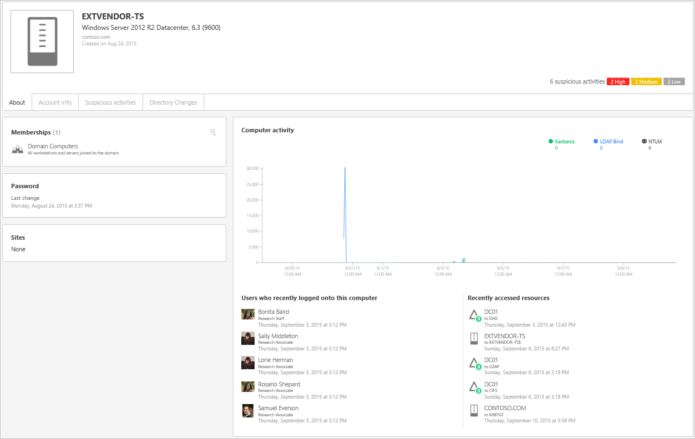

*S’applique à : Advanced Threat Analytics version 1.7*

# Utilisation de la console ATA

Utilisez la console ATA pour surveiller les activités suspectes et les gérer.

## Activation de l’accès à la console ATA
Pour ouvrir une session dans la console ATA, vous devez utiliser le compte d’un utilisateur auquel a été attribué le rôle ATA approprié pour accéder à la console ATA. Pour plus d’informations sur le contrôle d’accès en fonction du rôle (RBAC) dans ATA, consultez [Utilisation de groupes de rôles ATA](ata-role-groups.md).

## Connexion à la console ATA

1. Sur le serveur du centre ATA, cliquez sur l’icône **Console ATA Microsoft** sur le Bureau ou ouvrez un navigateur pour accéder à la console ATA.

    

>[!NOTE]
> Vous pouvez également ouvrir un navigateur à partir du centre ATA ou de la passerelle ATA et accéder à l’adresse IP que vous avez configurée dans l’installation du centre ATA pour la console ATA.    

2.  Entrez votre nom d’utilisateur et votre mot de passe, puis cliquez sur **Se connecter**.

## Console ATA

La console ATA fournit un aperçu rapide de toutes les activités suspectes par ordre chronologique. Elle vous permet d’examiner les détails de toutes les activités et d’effectuer des actions en fonction de ces activités. La console affiche également des alertes et des notifications pour signaler des problèmes liés au réseau ATA ou aux nouvelles activités considérées comme suspectes.

Voici les principaux éléments de la console ATA.

### Chronologie des attaques

Il s’agit de la page de destination qui s’affiche par défaut quand vous vous connectez à la console ATA. Par défaut, toutes les activités suspectes ouvertes sont affichées dans la chronologie des attaques. Vous pouvez filtrer la chronologie des attaques de manière à tout afficher ou de manière à afficher uniquement les activités suspectes dont l’état est Ouvert, Résolu ou Ignoré. Vous pouvez également voir le niveau de gravité attribué à chaque activité.

Pour plus d’informations, consultez [Gestion des activités suspectes](/advanced-threat-analytics/deploy-use/working-with-suspicious-activities).

### Barre de notification

Quand une activité suspecte est détectée, la barre de notification s’ouvre automatiquement sur la droite. Si de nouvelles activités suspectes ont été détectées depuis la dernière ouverture de session, la barre de notification s’ouvrira après votre connexion. Pour accéder à la barre de notification, vous pouvez cliquer sur la flèche de droite à tout moment.

### Filtrage du panneau

Vous pouvez filtrer les activités suspectes qui s’affichent dans la chronologie des attaques ou sous l’onglet Activités suspectes du profil d’entité, selon leur l’état et leur niveau de gravité.

### Barre de recherche

Le menu supérieur comprend une barre de recherche. Vous pouvez rechercher un utilisateur spécifique, un ordinateur ou un groupe dans ATA. Pour tester la fonction de recherche, commencez à taper un nom.

### Centre d’intégrité

Le centre d’intégrité envoie des alertes quand un élément du déploiement ATA ne fonctionne pas correctement.

Quand votre système rencontre un problème, par exemple une erreur de connectivité ou une passerelle ATA déconnectée, l’icône du centre d’intégrité vous en informe à l’aide d’un point rouge. 

Les alertes du centre d’intégrité peuvent être ignorées ou résolues, et classées comme étant d’importance haute, moyenne ou faible. Si vous résolvez une alerte que le service ATA détecte comme étant toujours active, elle sera automatiquement mise dans la liste des alertes ouvertes. Si le système détecte que l’alerte n’a plus de raison d’être (le problème a été résolu), l’alerte est placée automatiquement dans la liste des alertes résolues.

### Profils d’utilisateur et d’ordinateur

ATA crée un profil pour chaque utilisateur et chaque ordinateur du réseau. Le profil utilisateur contient des informations générales, telles que l’appartenance aux groupes, les connexions récentes et les ressources récemment consultées.

Le profil d’ordinateur contient des informations générales, telles que les connexions récentes et les ressources récemment consultées.

ATA fournit des informations supplémentaires sur les entités (ordinateurs, appareils, utilisateurs) dans les pages suivantes : Résumé, Activités et Activités suspectes.

Quand ATA n’est pas en mesure de résoudre complètement un profil, il l’indique par une icône représentant un cercle à demi rempli.

### Mini-profil

Quand une entité est présentée dans la console (par exemple un utilisateur ou un ordinateur), si vous pointez votre souris dessus, un mini-profil s’ouvre automatiquement et affiche les informations suivantes si elles sont disponibles :

-   Nom

-   Image

-   Courrier électronique

-   Téléphone

-   Nombre d’activités suspectes par niveau de gravité

## Voir aussi
[Consultez le forum ATA !](https://social.technet.microsoft.com/Forums/security/home?forum=mata)

<!--HONumber=Feb17_HO1-->

