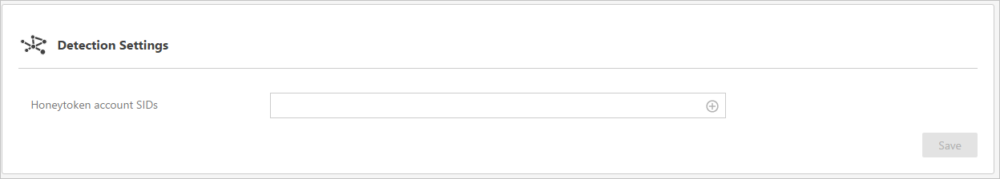

*S’applique à : Advanced Threat Analytics version 1.7*

# Gestion des paramètres de la détection ATA
La page de configuration **Détection** permet de configurer une liste d’adresses IP et de sous-réseaux ayant des circonstances inhabituelles et qui doivent donc être gérés différemment des autres entités de votre réseau.

## Configuration de la détection
Dans la section **Détection**, vous pouvez définir les éléments suivants :

-   **SID de comptes honeytoken** : ce compte d’utilisateur ne doit pas avoir d’activité réseau. Ce compte sera configuré comme l’utilisateur honeytoken ATA. Si quelqu’un tente d’utiliser ce compte d’utilisateur, ATA crée une alerte d’activité suspecte avec une indication d’activité malveillante. Pour configurer l’utilisateur honeytoken, vous aurez besoin du SID du compte d’utilisateur, et non du nom d’utilisateur.

>[!NOTE]
> Vous trouverez le SID de l’utilisateur sous l’onglet *Informations sur le compte* du profil de l’utilisateur dans la console ATA.

**Exclusions de détection** - Vous pouvez exclure des adresses IP des détections suivantes. Si vous ajoutez une adresse IP dans une de ces listes, ATA exclura cette adresse IP de ce type précis d’activité.

-   Exclusions d’adresses IP DNS Reconnaissance

-   Exclusions d’adresses IP Pass-the-Ticket

## Voir aussi
- [Gestion des activités suspectes](working-with-suspicious-activities.md)
- [Modification de la configuration d’ATA](modifying-ata-configuration.md)
- [Consultez le forum ATA !](https://social.technet.microsoft.com/Forums/security/home?forum=mata)

<!--HONumber=Feb17_HO1-->

