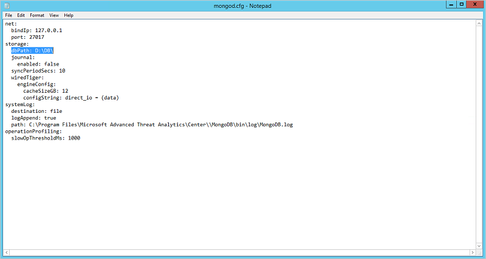

*S’applique à : Advanced Threat Analytics version 1.8*

# Gestion de la base de données ATA
Si vous voulez déplacer, sauvegarder ou restaurer la base de données ATA, suivez ces procédures pour MongoDB.

## Sauvegarde de la base de données ATA
Reportez-vous à la [documentation MongoDB correspondante](http://docs.mongodb.org/manual/administration/backup/).

## Restauration de la base de données ATA
Reportez-vous à la [documentation MongoDB correspondante](http://docs.mongodb.org/manual/administration/backup/).

## Déplacement de la base de données ATA vers un autre lecteur

1.  Arrêtez le service **Microsoft Advanced Threat Analytics Center**.
> [!Important] 
> Assurez-vous que le service ATA Center est arrêté avant de passer à l’étape suivante.

2.  Arrêtez le service **MongoDB**.

3.  Ouvrez le fichier de configuration Mongo situé par défaut à l’emplacement suivant : C:\Program Files\Microsoft Advanced Threat Analytics\Center\MongoDB\bin\mongod.cfg.

    Trouvez le paramètre `storage: dbPath`.

4.  Déplacez le dossier indiqué dans le paramètre `dbPath` vers le nouvel emplacement.

5.  Remplacez le paramètre `dbPath` du fichier de configuration mongo par le nouveau chemin de dossier, puis enregistrez et fermez le fichier.

    

6.  Démarrez le service **MongoDB**.

7. Démarrez le service **Microsoft Advanced Threat Analytics Center**.

## Voir aussi
- [Architecture d’ATA](ata-architecture.md)
- [Prérequis au déploiement d’ATA](ata-prerequisites.md)
- [Consultez le forum ATA !](https://social.technet.microsoft.com/Forums/security/home?forum=mata)

