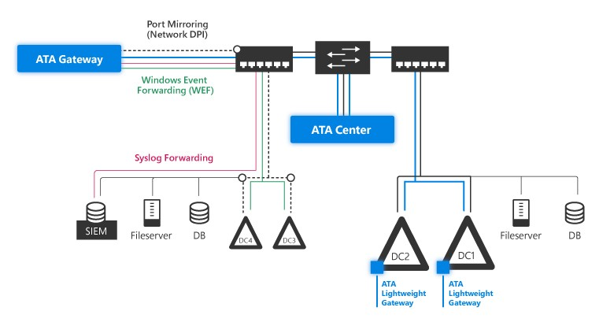

*S’applique à : Advanced Threat Analytics version 1.8*

# Prérequis pour ATA
Cet article décrit la configuration requise pour réussir le déploiement d’ATA dans votre environnement.

>[!NOTE]
> Pour plus d’informations sur la façon de planifier les ressources et la capacité, consultez [Planification de la capacité ATA](ata-capacity-planning.md).

Les différents composants d’ATA sont le centre ATA, la passerelle ATA et/ou la passerelle légère ATA. Pour plus d’informations sur les composants d’ATA, consultez [Architecture d’ATA](ata-architecture.md).

Le système ATA fonctionne sur la limite de forêt Active Directory et prend en charge le niveau fonctionnel de forêt Windows 2003 et versions ultérieures.

[Avant de commencer](#before-you-start) : cette section répertorie les informations que vous devez rassembler ainsi que les comptes et entités réseau dont vous devez disposer avant de procéder à l’installation d’ATA.

[Centre ATA](#ata-center-requirements) : cette section répertorie le matériel du centre ATA, la configuration logicielle requise ainsi que les paramètres que vous devez configurer sur le serveur de votre centre ATA.

[Passerelle ATA](#ata-gateway-requirements) : cette section répertorie le matériel de la passerelle ATA, la configuration logicielle requise ainsi que les paramètres que vous devez configurer sur les serveurs de votre passerelle ATA.

[Passerelle légère ATA](#ata-lightweight-gateway-requirements) : cette section répertorie le matériel de la passerelle légère ATA et la configuration logicielle requise.

[Console ATA](#ata-console) : cette section répertorie la configuration requise du navigateur pour exécuter la console ATA.

## Avant de commencer
Cette section répertorie les informations que vous devez rassembler ainsi que les comptes et entités réseau dont vous devez disposer avant de procéder à l’installation d’ATA.

-   Compte d’utilisateur et mot de passe avec accès en lecture à tous les objets dans les domaines surveillés.

    > [!NOTE]
    > Si vous avez défini des listes de contrôle d’accès (ACL) personnalisées sur différentes unités d’organisation dans votre domaine, vérifiez que l’utilisateur sélectionné dispose d’autorisations d’accès en lecture à ces unités d’organisation.

-   N’installez pas Microsoft Message Analyzer sur une passerelle ATA ou une passerelle légère ATA. Le pilote de Message Analyzer est en conflit avec les pilotes de la passerelle ATA et de la passerelle légère ATA. Si vous exécutez Wireshark sur la passerelle ATA, vous devez redémarrer le service de passerelle Microsoft Advanced Threat Analytics après avoir arrêté la capture Wireshark. Si ce n’est pas le cas, la passerelle arrête la capture du trafic. Notez que l’exécution de Wireshark sur une passerelle légère ATA n’interfère pas avec la passerelle légère ATA.

-    Recommandé : L’utilisateur doit disposer d’autorisations en lecture seule sur le conteneur Objets supprimés. ATA peut ainsi détecter la suppression en bloc d’objets du domaine. Pour plus d’informations sur la configuration des autorisations en lecture seule sur le conteneur Objets supprimés, consultez la section **Modifier les autorisations sur un conteneur d’objets supprimés** dans la rubrique [Afficher ou définir des autorisations sur un objet d’annuaire](https://technet.microsoft.com/library/cc816824%28v=ws.10%29.aspx).

-   Facultatif : compte d’un utilisateur sans activité réseau. Ce compte est configuré comme l’utilisateur honeytoken ATA. Pour configurer l’utilisateur honeytoken, vous devez disposer du SID du compte d’utilisateur, et non du nom d’utilisateur. Pour plus d’informations, consultez la page [Gérer les paramètres de la détection ATA](https://docs.microsoft.com/en-us/advanced-threat-analytics/deploy-use/working-with-detection-settings).

-   Facultatif : Outre la collecte et l’analyse du trafic réseau à destination et en provenance des contrôleurs de domaine, ATA peut utiliser les événements Windows 4776, 4732, 4733, 4728, 4729, 4756 et 4757 pour améliorer la détection de l’attaque Pass-the-Hash, de l’attaque par force brute, de la modification des groupes sensibles et des comptes Honeytoken. Vous pouvez recevoir ces événements à partir de votre serveur SIEM ou définir le transfert d’événements Windows à partir de votre contrôleur de domaine. Les événements collectés fournissent à ATA des informations supplémentaires qui ne sont pas accessibles par le biais du trafic réseau du contrôleur de domaine.

## Configuration requise pour le centre ATA
Cette section décrit la configuration requise pour le centre ATA.
### Général
L’installation du centre ATA sur un serveur Windows Server 2012 R2 ou Windows Server 2016 est prise en charge. Le centre ATA peut être installé sur un serveur membre d’un domaine ou d’un groupe de travail.

Avant d’installer le centre ATA sur Windows 2012 R2, vérifiez que la mise à jour suivante a été installée : [KB2919355](https://support.microsoft.com/kb/2919355/).

Pour vous en assurer, exécutez l’applet de commande Windows PowerShell suivante : `[Get-HotFix -Id kb2919355]`

L’installation du centre ATA en tant que machine virtuelle est prise en charge. 

>[!NOTE] 
> En cas d’exécution en tant que machine virtuelle, la mémoire dynamique ou toute autre fonctionnalité d’augmentation de la mémoire n’est pas prise en charge.

Si vous exécutez le centre ATA en tant que machine virtuelle, arrêtez le serveur avant de créer un point de contrôle pour éviter tout risque d’endommagement de la base de données.
### Spécifications du serveur
Sur un serveur physique, la base de données ATA nécessite la **désactivation** de l’accès mémoire non uniforme (NUMA) dans le BIOS. Votre système peut parler d’entrelacement de nœuds pour faire référence à NUMA, auquel cas vous devrez **activer** l’entrelacement de nœuds pour désactiver NUMA. Pour plus d’informations, consultez la documentation du BIOS. Notez que cela ne s’applique pas quand le centre ATA s’exécute sur un serveur virtuel. 
Pour bénéficier de performances optimales, choisissez **Hautes performances** comme **Option d’alimentation** pour le centre ATA. 
Le nombre de contrôleurs de domaine que vous surveillez et la charge sur chacun des contrôleurs de domaine déterminent les spécifications du serveur. Pour plus d’informations, consultez [Planification de la capacité ATA](ata-capacity-planning.md).

### Synchronisation de l’heure
L’heure du serveur du centre ATA, des serveurs de la passerelle ATA et des contrôleurs de domaine doit être synchronisée pour que tout écart entre eux ne dépasse pas cinq minutes.

### Cartes réseau
Vous devez disposer des éléments suivants :
-   Au moins une carte réseau (si vous utilisez des serveurs physiques dans un environnement de réseau local virtuel, nous vous recommandons d’utiliser deux cartes réseau)

-   Une adresse IP, chiffrée à l’aide du protocole SSL sur le port 443, pour la communication entre le centre ATA et la passerelle ATA. (Le service ATA est lié à toutes les adresses IP sur le port 443 du centre ATA.)

### Ports
Le tableau suivant répertorie les ports qui, au minimum, doivent être ouverts pour que le centre ATA fonctionne correctement.

|Protocole|Transport|Port|Vers/À partir de|Sens|
|------------|-------------|--------|-----------|-------------|
|**SSL** (communications ATA)|TCP|443 ou configurable|Passerelle ATA|Entrant|
|**HTTP** (facultatif)|TCP|80|Réseau d'entreprise|Entrant|
|**HTTPS**|TCP|443|Réseau d’entreprise et passerelle ATA|Entrant|
|**SMTP** (facultatif)|TCP|25|Serveur SMTP|Sortant|
|**SMTPS** (facultatif)|TCP|465|Serveur SMTP|Sortant|
|**Syslog** (facultatif)|TCP|514|Serveur syslog|Sortant|
|**LDAP**|TCP et UDP|389|Contrôleurs de domaine|Sortant|
|**LDAPS** (facultatif)|TCP|636|Contrôleurs de domaine|Sortant|
|**DNS**|TCP et UDP|53|Serveurs DNS|Sortant|
|**Kerberos** (facultatif si joint à un domaine)|TCP et UDP|88|Contrôleurs de domaine|Sortant|
|**Netlogon** (facultatif si joint à un domaine)|TCP et UDP|445|Contrôleurs de domaine|Sortant|
|**Horloge Windows** (facultatif si joint à un domaine)|UDP|123|Contrôleurs de domaine|Sortant|

> [!NOTE]
> LDAP est obligatoire pour tester les informations d’identification à utiliser entre les passerelles ATA et les contrôleurs de domaine. Le test est effectué à partir du centre ATA sur un contrôleur de domaine pour tester la validité de ces informations d’identification. Ensuite, la passerelle ATA utilise le protocole LDAP dans le cadre de son processus de résolution normal.

### Certificats

Pour faciliter l’installation d’ATA, vous pouvez installer des certificats auto-signés pendant l’installation. Une fois le déploiement terminé, remplacez les certificats auto-signés par un certificat d’une autorité de certification interne pour être utilisé par le centre ATA.

Vérifiez que le centre ATA et les passerelles ATA ont accès au point de distribution de votre liste de révocation de certificats. S’ils n’ont pas accès à Internet, suivez la [procédure d’importation manuelle d’une liste de révocation de certificats](https://technet.microsoft.com/library/aa996972%28v=exchg.65%29.aspx) en veillant à installer l’ensemble des points de distribution de la liste pour toute la chaîne.

Le certificat doit avoir les éléments suivants :
-   Une clé privée
-   Un fournisseur de type CSP (fournisseur de services de chiffrement) ou de type KSP (fournisseur de stockage de clés)
-   Une clé publique de 2 048 bits de longueur
-   Des indicateurs d’utilisation KeyEncipherment et ServerAuthentication définis à une valeur

Par exemple, vous pouvez utiliser les modèles standard **Serveur web** ou **Ordinateur**.

> [!WARNING]
> - Le processus de renouvellement d’un certificat existant n’est pas pris en charge. La seule façon de renouveler un certificat consiste à créer un certificat et à configurer ATA pour qu’il utilise le nouveau certificat.

> [!NOTE]
> - Si vous souhaitez accéder à la console ATA à partir d’autres ordinateurs, vérifiez que ces derniers approuvent le certificat utilisé par le centre ATA. Sinon, vous obtiendrez une page d’avertissement indiquant un problème avec le certificat de sécurité du site web avant d’accéder à la page de connexion.
> - Depuis ATA version 1.8, les passerelles ATA et les passerelles légères gèrent leurs propres certificats et n’ont besoin d’aucune interaction de la part de l’administrateur pour les gérer.

## Configuration requise pour la passerelle ATA
Cette section décrit la configuration requise pour la passerelle ATA.
### Général
L’installation de la passerelle ATA sur un serveur Windows Server 2012 R2 ou Windows Server 2016 est prise en charge (y compris Server Core).
La passerelle ATA peut être installée sur un serveur membre d’un domaine ou d’un groupe de travail.
La passerelle ATA peut servir à analyser les contrôleurs de domaine avec le niveau fonctionnel de domaine Windows 2003 et versions ultérieures.

Avant d’installer la passerelle ATA sur Windows 2012 R2, vérifiez que la mise à jour suivante a été installée : [KB2919355](https://support.microsoft.com/kb/2919355/).

Pour vous en assurer, exécutez l’applet de commande Windows PowerShell suivante : `[Get-HotFix -Id kb2919355]`

Pour plus d’informations sur l’utilisation de machines virtuelles avec la passerelle ATA, consultez [Configurer la mise en miroir des ports](configure-port-mirroring.md).

> [!NOTE]
> Un minimum de 5 Go d’espace sont nécessaires et 10 Go sont recommandés. Cela inclut l’espace nécessaire pour les fichiers binaires ATA, les [journaux ATA](troubleshooting-ata-using-logs.md) et les [journaux de performances](troubleshooting-ata-using-perf-counters.md).

### Spécifications du serveur
Pour bénéficier de performances optimales, choisissez **Hautes performances** comme **Option d’alimentation** pour la passerelle ATA. 
Une passerelle ATA peut prendre en charge la surveillance de plusieurs contrôleurs de domaine, en fonction du volume du trafic réseau à destination et en provenance des contrôleurs de domaine.

>[!NOTE] 
> En cas d’exécution en tant que machine virtuelle, la mémoire dynamique ou toute autre fonctionnalité d’augmentation de la mémoire n’est pas prise en charge.

Pour plus d’informations sur la configuration matérielle requise pour la passerelle ATA, consultez [Planification de la capacité ATA](ata-capacity-planning.md).

### Synchronisation de l’heure
L’heure du serveur du centre ATA, des serveurs de la passerelle ATA et des contrôleurs de domaine doit être synchronisée pour que tout écart entre eux ne dépasse pas cinq minutes.

### Cartes réseau
La passerelle ATA nécessite au moins une carte de gestion et au moins une carte de capture :

-   **Carte de gestion** : cette carte est utilisée pour les communications sur votre réseau d’entreprise. Elle doit être configurée avec les éléments suivants :

    -   Adresse IP statique (passerelle par défaut incluse)

    -   Serveurs DNS préféré et auxiliaire

    -   Le **Suffixe DNS pour cette connexion** doit être le nom DNS du domaine pour chaque domaine surveillé.

        

        > [!NOTE]
        > Si la passerelle ATA est membre du domaine, le suffixe peut être configuré automatiquement.

-   **Carte de capture** : cette carte est utilisée pour capturer le trafic à destination et en provenance des contrôleurs de domaine.

    > [!IMPORTANT]
    > -   Configurez la mise en miroir des ports de la carte de capture comme la destination du trafic réseau des contrôleurs de domaine. Pour plus d’informations, consultez [Configurer la mise en miroir des ports](configure-port-mirroring.md). En règle générale, vous devez collaborer avec l’équipe de virtualisation ou de mise en réseau pour configurer la mise en miroir des ports.
    > -   Configurez une adresse IP statique non routable pour votre environnement, sans passerelle par défaut ni adresse de serveur DNS. Par exemple : 1.1.1.1/32. Cela permet de garantir que la carte réseau de capture peut capturer le volume maximum de trafic et que la carte réseau de gestion est utilisée pour envoyer et recevoir le trafic réseau demandé.

### Ports
Le tableau suivant répertorie les ports qui, au minimum, doivent être configurés sur la carte de gestion pour satisfaire aux exigences de la passerelle ATA :

|Protocole|Transport|Port|Vers/À partir de|Sens|
|------------|-------------|--------|-----------|-------------|
|LDAP|TCP et UDP|389|Contrôleurs de domaine|Sortant|
|LDAP sécurisé (LDAPS)|TCP|636|Contrôleurs de domaine|Sortant|
|LDAP vers le catalogue global|TCP|3268|Contrôleurs de domaine|Sortant|
|LDAPS vers le catalogue global|TCP|3269|Contrôleurs de domaine|Sortant|
|Kerberos|TCP et UDP|88|Contrôleurs de domaine|Sortant|
|Netlogon|TCP et UDP|445|Contrôleurs de domaine|Sortant|
|Horloge Windows|UDP|123|Contrôleurs de domaine|Sortant|
|DNS|TCP et UDP|53|Serveurs DNS|Sortant|
|NTLM sur RPC|TCP|135|Tous les appareils sur le réseau|Sortant|
|NetBIOS|UDP|137|Tous les appareils sur le réseau|Sortant|
|SSL|TCP|443 ou comme configuré pour le service du centre|Centre ATA :  - Adresse IP du service du centre -   Adresse IP de la console|Sortant|
|Syslog (facultatif)|UDP|514|Serveur SIEM|Entrant|

> [!NOTE]
> Dans le cadre du processus de résolution effectué par la passerelle ATA, les ports suivants doivent être ouverts en entrée sur les appareils du réseau à partir des passerelles ATA.
>
> -   NTLM sur RPC (port TCP 135)
> -   NetBIOS (port UDP 137)

## Configuration requise pour la passerelle légère ATA
Cette section décrit la configuration requise pour la passerelle légère ATA.
### Général
La passerelle légère ATA prend en charge l’installation sur un contrôleur de domaine exécutant Windows Server 2008 R2 SP1 (Server Core non inclus), Windows Server 2012, Windows Server 2012 R2 et Windows Server 2016 (Core inclus, mais pas Nano).

Le contrôleur de domaine peut être un contrôleur de domaine en lecture seule (RODC).

Avant d’installer la passerelle légère ATA sur un contrôleur de domaine exécutant Windows Server 2012 R2, vérifiez que la mise à jour suivante a été installée : [KB2919355](https://support.microsoft.com/kb/2919355/).

Pour vous en assurer, exécutez l’applet de commande Windows PowerShell suivante : `[Get-HotFix -Id kb2919355]`

Si l’installation est pour Windows Server 2012 R2 Server Core, la mise à jour suivante doit également être installée : [KB3000850](https://support.microsoft.com/help/3000850/november-2014-update-rollup-for-windows-rt-8.1%2c-windows-8.1%2c-and-windows-server-2012-r2).

 Pour vous en assurer, exécutez l’applet de commande Windows PowerShell suivante : `[Get-HotFix -Id kb3000850]`

Pendant l’installation, le .Net Framework 4.6.1 est installé et peut entraîner un redémarrage du contrôleur de domaine.

> [!NOTE]
> Un minimum de 5 Go d’espace sont nécessaires et 10 Go sont recommandés. Cela inclut l’espace nécessaire pour les fichiers binaires ATA, les [journaux ATA](troubleshooting-ata-using-logs.md) et les [journaux de performances](troubleshooting-ata-using-perf-counters.md).

### Spécifications du serveur

La passerelle légère ATA nécessite au minimum deux cœurs et 6 Go de RAM sur le contrôleur de domaine.
Pour bénéficier de performances optimales, choisissez **Hautes performances** comme **Option d’alimentation** pour la passerelle légère ATA.
Vous pouvez déployer la passerelle légère ATA sur des contrôleurs de domaine de différentes charges et tailles, en fonction de la quantité de trafic réseau vers et à partir des contrôleurs de domaine et de la quantité de ressources installées sur ce contrôleur de domaine.

>[!NOTE] 
> En cas d’exécution en tant que machine virtuelle, la mémoire dynamique ou toute autre fonctionnalité d’augmentation de la mémoire n’est pas prise en charge.

Pour plus d’informations sur la configuration matérielle requise pour la passerelle légère ATA, consultez [Planification de la capacité ATA](ata-capacity-planning.md).

### Synchronisation de l’heure
L’heure du serveur du centre ATA, des serveurs de la passerelle légère ATA et des contrôleurs de domaine doit être synchronisée pour que tout écart entre eux ne dépasse pas cinq minutes.
### Cartes réseau
La passerelle légère ATA surveille le trafic local sur toutes les cartes réseau du contrôleur de domaine.  
Après le déploiement, vous pouvez utiliser la console ATA si vous voulez changer les cartes réseau analysées.

### Ports
Le tableau suivant répertorie les ports qui, au minimum, sont requis par la passerelle légère ATA :

|Protocole|Transport|Port|Vers/À partir de|Sens|
|------------|-------------|--------|-----------|-------------|
|DNS|TCP et UDP|53|Serveurs DNS|Sortant|
|NTLM sur RPC|TCP|135|Tous les appareils sur le réseau|Sortant|
|NetBIOS|UDP|137|Tous les appareils sur le réseau|Sortant|
|SSL|TCP|443 ou comme configuré pour le service du centre|Centre ATA :  - Adresse IP du service du centre -   Adresse IP de la console|Sortant|
|Syslog (facultatif)|UDP|514|Serveur SIEM|Entrant|

> [!NOTE]
> Dans le cadre du processus de résolution effectué par la passerelle légère ATA, les ports suivants doivent être ouverts en entrée sur les appareils du réseau à partir des passerelles légères ATA.
>
> -   NTLM sur RPC
> -   NetBIOS

## Console ATA
L’accès à la console ATA s’effectue au moyen d’un navigateur, avec prise en charge des éléments suivants :

-   Internet Explorer 10 et versions ultérieures

-   Microsoft Edge

-   Google Chrome 40 et versions ultérieures

-   Largeur d’écran d’une résolution minimale de 1 700 pixels

## Vidéos connexes
- [Sélection du type de passerelle ATA approprié](https://channel9.msdn.com/Shows/Microsoft-Security/ATA-Deployment-Choose-the-Right-Gateway-Type)

## Voir aussi
- [Outil de dimensionnement ATA](http://aka.ms/atasizingtool)
- [Architecture d’ATA](ata-architecture.md)
- [Installer ATA](install-ata-step1.md)
- [Consultez le forum ATA !](https://social.technet.microsoft.com/Forums/security/home?forum=mata)

