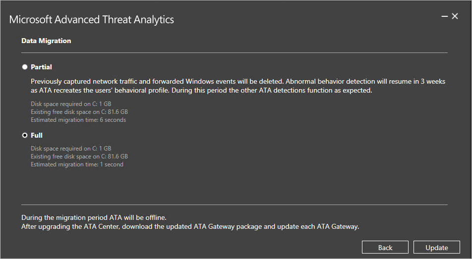
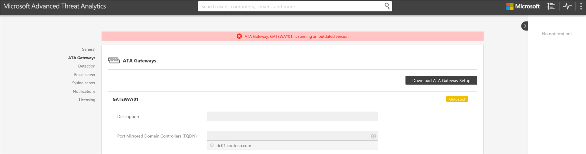
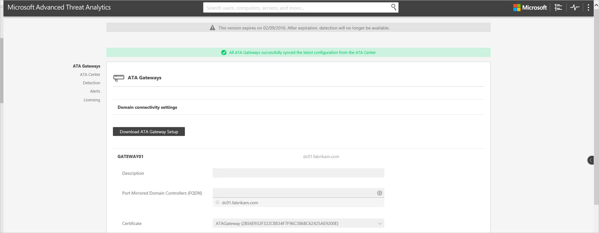

# Mise à jour d’ATA vers la version 1.5 : guide de migration
La mise à jour vers ATA 1.5 comprend des améliorations dans les domaines suivants :

-   Détection plus rapide

-   Algorithme de détection automatique amélioré pour les périphériques de traduction d’adresses réseau (NAT)

-   Processus de résolution des noms amélioré pour les appareils non joints à un domaine

-   Prise en charge de la migration des données pendant les mises à jour

-   Meilleure réactivité de l’interface utilisateur face à des activités suspectes impliquant plusieurs milliers d’entités

-   Résolution automatique améliorée pour les alertes de surveillance

-   Compteurs de performances supplémentaires pour une meilleure surveillance et une meilleure résolution des problèmes

## Mise à jour d’ATA vers la version 1.5
> [!NOTE]
> Si ATA n’est pas installé dans votre environnement, téléchargez la version complète d’ATA qui inclut la version 1.5. Suivez ensuite la procédure d’installation standard décrite dans [Installer ATA](install-ata-step1.md).

Si vous avez déjà déployé ATA version 1.4, cette procédure vous guide tout au long des étapes nécessaires pour mettre à jour votre installation.

Suivez ces étapes pour mettre à jour ATA vers la version 1.5 :

1.  Téléchargez ATA v1.5 à partir de VLSC ou de MSDN.
      > [!NOTE]
         Vous pouvez aussi utiliser la version complète d’ATA pour mettre à jour votre installation vers la version 1.5.

2.  Mettez à jour le centre ATA.

3.  Téléchargez le package mis à jour de la passerelle ATA.

4.  Mettez à jour les passerelles ATA.

    > [!IMPORTANT]
    > Pour assurer le bon fonctionnement d’ATA, mettez à jour toutes les passerelles.

### Étape 1 : mettre à jour le centre ATA

1.  Sauvegardez votre base de données (facultatif) :

    -   Si le centre ATA s’exécute en tant que machine virtuelle et que vous souhaitez effectuer un point de contrôle, commencez par arrêter la machine virtuelle.

    -   Si le centre ATA s’exécute sur un serveur physique, suivez la procédure recommandée pour [sauvegarder MongoDB](https://docs.mongodb.org/manual/core/backups/).

2.  Exécutez le fichier de mise à jour, Microsoft ATA Center Update.exe, puis suivez les instructions à l’écran pour installer la mise à jour.

    1.  Dans la page **Bienvenue**, sélectionnez votre langue, puis cliquez sur **Suivant**.

    2.  Lisez le Contrat de Licence Utilisateur Final et, si vous en acceptez les termes, cochez la case et cliquez sur **Suivant**.

    3.  Indiquez si vous souhaitez exécuter la migration complète (par défaut) ou la migration partielle.

        

        -   Si vous sélectionnez la migration **Partielle**, tout le trafic réseau collecté et les événements Windows transférés qui ont été analysés par ATA sont supprimés. Les profils de comportement des utilisateurs doivent aussi être réappris, ce qui nécessite au moins trois semaines. Si vous manquez d’espace disque, il est judicieux d’opter pour une migration **Partielle**.

        -   Si vous exécutez une migration **Complète**, vous avez besoin de plus d’espace disque (quantité indiquée dans la page de mise à niveau). Il est aussi possible que la migration prenne plus de temps en fonction du trafic réseau. La migration complète conserve toutes les données collectées précédemment et préserve les profils de comportement des utilisateurs. Comme il est inutile de réapprendre les profils de comportement, ATA peut détecter les comportements anormaux dès la mise à jour terminée.

3.  Cliquez sur **Mettre à jour**. Quand vous cliquez sur Mettre à jour, ATA passe en mode hors connexion jusqu’à la fin de la mise à jour.

4.  Une fois le centre ATA mis à jour, les passerelles ATA indiquent qu’elles sont obsolètes.

    

> [!IMPORTANT]
> - Pour assurer le bon fonctionnement d’ATA, mettez à jour toutes les passerelles.

### Étape 2. Télécharger le package d’installation de la passerelle ATA
Après avoir configuré les paramètres de connectivité du domaine, vous pouvez télécharger le package d’installation de la passerelle ATA.

Pour télécharger le package d’installation de la passerelle ATA :

1.  Supprimez les versions précédemment téléchargées du package de la passerelle ATA.

2.  Sur la machine de la passerelle ATA, ouvrez un navigateur et entrez l’adresse IP de la console ATA que vous avez configurée dans le centre ATA. Une fois la console ATA ouverte, cliquez sur l’icône des paramètres et sélectionnez **Configuration**.

    

3.  Sous l’onglet **Passerelles ATA**, cliquez sur **Télécharger l’installation de la passerelle ATA**.

4.  Enregistrez le package localement.

Le fichier zip comprend les fichiers suivants :

-   Programme d’installation de la passerelle ATA

-   Fichier de paramètres de configuration avec les informations requises pour se connecter au centre ATA

### Étape 3 : mettre à jour les passerelles ATA

1.  Sur chaque passerelle ATA, extrayez les fichiers du package de passerelle ATA et exécutez le fichier Microsoft ATA Gateway Setup.

    > [!NOTE]
    > Vous pouvez également utiliser ce package pour installer de nouvelles passerelles ATA.

2.  Vos paramètres précédents sont conservés, mais le redémarrage du service peut prendre quelques minutes.

3.  Répétez cette étape pour toutes les autres passerelles ATA déployées.

> [!NOTE]
> Une fois la passerelle ATA mise à jour avec succès, la notification d’obsolescence de cette passerelle ATA disparaît.

Si toutes les passerelles ATA indiquent qu’elles ont été synchronisées avec succès et que le message signalant l’existence d’un package de passerelle ATA mis à jour ne s’affiche plus, vous savez que toutes les passerelles ATA ont été correctement mises à jour.

## Voir aussi

- [Consultez le forum ATA !](https://social.technet.microsoft.com/Forums/security/home?forum=mata)
