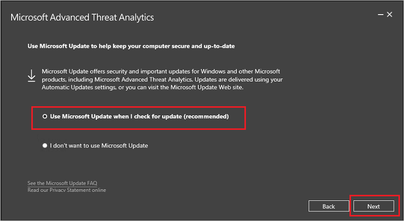

# Mise à jour d’ATA vers la version 1.8

> [!NOTE] 
> Si ATA n’est pas installé dans votre environnement, téléchargez la version complète d’ATA qui inclut la version 1.8. Suivez ensuite la procédure d’installation standard décrite dans [Installer ATA](install-ata-step1.md).

Si vous avez déjà déployé la version 1.7 d’ATA, cette procédure vous guide tout au long des étapes nécessaires pour mettre à jour votre déploiement.

> [!NOTE] 
>  Seules les versions ATA 1.7 Update 1 et ATA 1.7 Update 2 peuvent être mises à jour vers la version 1.8, les versions précédentes d’ATA ne peuvent pas être directement mises à jour vers la version 1.8.

Suivez ces étapes pour mettre à jour ATA vers la version 1.8 :

1.  [Téléchargez la version mise à jour d’ATA 1.8 à partir du Centre de téléchargement](https://www.microsoft.com/download/details.aspx?id=55536) ou la version complète à partir du [Centre d’évaluation](http://www.microsoft.com/evalcenter/evaluate-microsoft-advanced-threat-analytics). 
Dans la version de migration, le fichier peut être utilisé uniquement pour la mise à jour d’ATA 1.7. Dans la version du Centre d’évaluation, le même fichier d’installation (Microsoft ATA Center Setup.exe) est utilisé pour l’installation d’un nouveau déploiement d’ATA et la mise à niveau des déploiements existants.

2.  Mettez à jour le centre ATA.

4.  Mettez à jour les passerelles ATA.

    > [!IMPORTANT]
    > Pour assurer le bon fonctionnement d’ATA, mettez à jour toutes les passerelles.

### Étape 1 : mettre à jour le centre ATA

1.  Sauvegardez votre base de données (facultatif) :

    -   Si le centre ATA s’exécute en tant que machine virtuelle et que vous souhaitez effectuer un point de contrôle, commencez par arrêter la machine virtuelle.

    -   Si le centre ATA est en cours d’exécution sur un serveur physique, consultez l’article [Récupération d’urgence](disaster-recovery.md) pour plus d’informations sur la sauvegarde de la base de données.

2.  Exécutez le fichier d’installation, **Microsoft ATA Center Setup.exe**, puis suivez les instructions à l’écran pour installer la mise à jour.

    -  Dans la page **Bienvenue**, choisissez votre langue et cliquez sur **Suivant**.

    -  Si vous n’avez pas activé les mises à jour automatiques dans la version 1.7, vous êtes invité à configurer ATA pour utiliser Microsoft Update afin de rester à jour.  Dans la page Microsoft Update, sélectionnez **Utiliser Microsoft Update lorsque je recherche des mises à jour (recommandé)**.
    
     
     Ceci ajuste les paramètres Windows pour activer les mises à jour pour ATA. 
    
    -  Dans l’écran **Migration des données**, indiquez si vous souhaitez migrer tout ou une partie des données. Si vous choisissez de migrer uniquement des données partielles, toutes les détections fonctionnent immédiatement à l’exception de la détection de comportement anormal, qui prend trois semaines pour générer un profil complet.  
    
    L’installation de la migration de données **Partielle** prend beaucoup moins de temps. Si vous sélectionnez la migration des données **Complète**, l’installation peut prendre beaucoup plus de temps. Vérifiez l’estimation de la quantité de temps et l’espace disque nécessaire, qui sont répertoriés dans l’écran **Migration des données**. Ces chiffres dépendent de la quantité de trafic réseau capturé précédemment que vous avez enregistrée dans les versions précédentes d’ATA. Par exemple, dans l’écran ci-dessous, vous pouvez voir une migration de données à partir d’une base de données volumineuse :
         
    

    -  Cliquez sur **Mettre à jour**. Une fois que vous avez cliqué sur Mettre à jour, ATA passe en mode hors connexion jusqu’à la fin de la mise à jour.

4.  Une fois la mise à jour du centre ATA terminée, cliquez sur **Lancer** pour afficher l’écran **Mettre à jour** dans la console ATA pour les passerelles ATA.

    

5.  Dans l’écran **Mises à jour**, si vous avez déjà configuré vos passerelles ATA pour une mise à jour automatique, elles sont mises à jour à ce stade. Sinon, cliquez sur **Mettre à jour** en regard de chaque passerelle ATA.
  

  
> [!IMPORTANT] 
> Pour assurer le bon fonctionnement d’ATA, mettez à jour toutes les passerelles.
 
> [!NOTE] 
> Pour installer de nouvelles passerelles ATA, accédez à l’écran **Passerelles** et cliquez sur **Télécharger le programme d’installation de la passerelle** pour obtenir le package d’installation ATA 1.8 et suivre les instructions d’installation de la nouvelle passerelle, comme décrit dans [Étape 4. Installer la passerelle ATA](install-ata-step4.md).

## Voir aussi

- [Consultez le forum ATA !](https://social.technet.microsoft.com/Forums/security/home?forum=mata)
