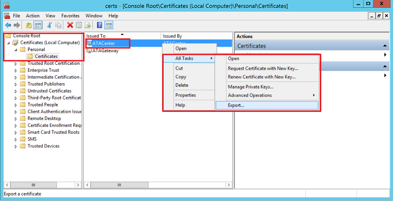

*S’applique à : Advanced Threat Analytics version 1.8*

# Récupération d’urgence d’ATA
Cet article décrit comment récupérer rapidement votre centre ATA et restaurer les fonctionnalités ATA quand le centre ATA a cessé de fonctionner, mais que les passerelles ATA fonctionnent encore. 

>[!NOTE]
> Le processus décrit ne récupère pas les activités suspectes détectées précédemment, mais rétablit le fonctionnement intégral du centre ATA. En outre, la période d’apprentissage nécessaire pour certaines détections de comportements redémarre, la majeure partie de la détection offerte par ATA étant néanmoins opérationnelle une fois le centre ATA restauré. 

## Sauvegarder votre configuration du centre ATA

1. La configuration du centre ATA est sauvegardée dans un fichier toutes les heures. Recherchez la dernière copie de sauvegarde de la configuration du centre ATA et enregistrez-la sur un ordinateur distinct. Pour obtenir une explication complète de la localisation de ces fichiers, consultez [Exporter et importer la configuration ATA](ata-configuration-file.md). 
2. Exportez le certificat du centre ATA.
    1. Dans le Gestionnaire de certificats, accédez à **Certificats (ordinateur local)** -> **Personnel** ->**Certificats**, puis sélectionnez **Centre ATA**.
    2. Cliquez avec le bouton droit sur **Centre ATA** et sélectionnez **Toutes les tâches** puis **Exportation**. 
     
    3. Suivez les instructions pour exporter le certificat, en veillant à exporter également la clé privée.
    4. Sauvegardez le fichier de certificat exporté sur un ordinateur distinct.

  > [!NOTE] 
  > Si vous ne pouvez pas exporter la clé privée, vous devez créer un nouveau certificat et le déployer sur ATA, comme décrit dans [Changer le certificat du centre ATA](modifying-ata-center-configuration#the-ata-center-certificate), puis l’exporter. 

## Récupérer votre centre ATA

1. Créez un ordinateur Windows Server en utilisant la même adresse IP et le même nom d’ordinateur que l’ordinateur du centre ATA précédent.
4. Importez le certificat que vous avez sauvegardé à l’étape précédente sur le nouveau serveur.
5. Suivez les instructions pour [déployer le centre ATA](install-ata-step1.md) sur le serveur Windows qui vient d’être créé. Il est inutile de redéployer les passerelles ATA. Lorsque vous êtes invité à fournir un certificat, fournissez le certificat que vous avez exporté lors de la sauvegarde de la configuration du centre ATA. 

6. Importez la configuration sauvegardée du centre ATA :
    1. Supprimez le document du profil système du centre ATA par défaut dans MongoDB : 
        1. Accédez à **C:\Program Files\Microsoft Advanced Threat Analytics\Center\MongoDB\bin**. 
        2. Exécutez `mongo.exe ATA` 
        3. Exécutez cette commande pour supprimer le profil système par défaut : `db.SystemProfile.remove({})`
    2. Exécutez la commande : `mongoimport.exe --db ATA --collection SystemProfile --file "<SystemProfile.json backup file>" --upsert` en utilisant le fichier de sauvegarde de l’étape 1. 
    Pour obtenir une explication complète de la localisation et de l’importation des fichiers de sauvegarde, consultez [Exporter et importer la configuration ATA](ata-configuration-file.md). 
    3. Ouvrez la console ATA. Vous devez normalement voir toutes les passerelles ATA liées sous l’onglet Configuration/Passerelles. 
    5. Veillez à définir un [**utilisateur des services d’annuaire**](install-ata-step2.md) et à choisir un [**synchronisateur de contrôleur de domaine**](install-ata-step5.md). 

## Voir aussi
- [Prérequis au déploiement d’ATA](ata-prerequisites.md)
- [Planification de la capacité d’ATA](ata-capacity-planning.md)
- [Configurer la collecte d’événements](configure-event-collection.md)
- [Configuration du transfert d’événements Windows](configure-event-collection#configuring-windows-event-forwarding)
- [Consultez le forum ATA !](https://social.technet.microsoft.com/Forums/security/home?forum=mata)
