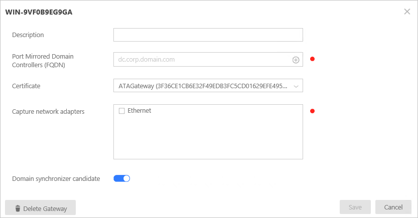
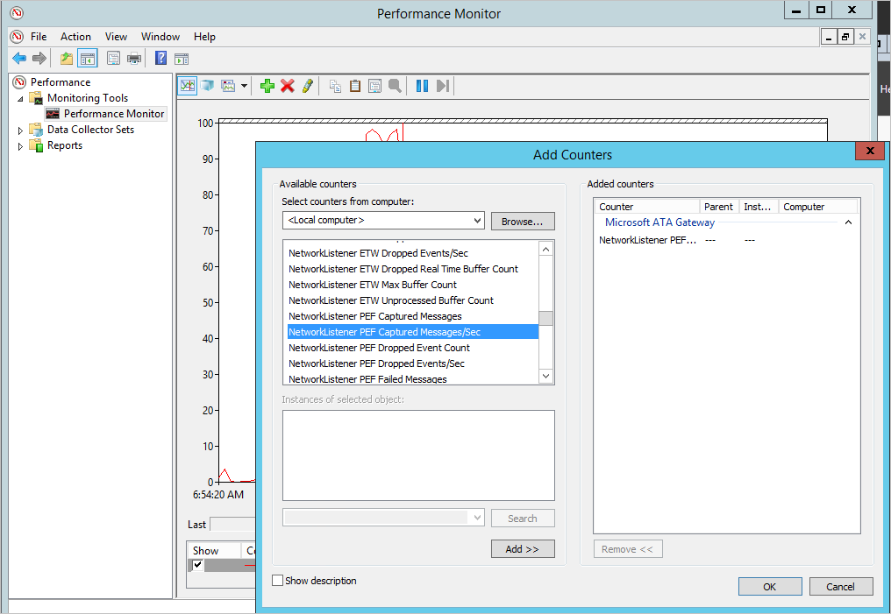

*S’applique à : Advanced Threat Analytics version 1.8*

# Installer ATA - Étape 5

>[!div class="step-by-step"]
[« Étape 4](install-ata-step4.md)
[Étape 6 »](install-ata-step6.md)

## Étape 5. Configurer les paramètres de la passerelle ATA
Une fois la passerelle ATA installée, procédez comme suit pour configurer ses paramètres.

1.  Dans la console ATA, accédez à **Configuration**, puis sous **Système**, sélectionnez **Passerelles**.
   
     

2.  Cliquez sur la passerelle que vous voulez configurer et entrez les informations suivantes :

    

  - **Description** : entrez une description pour la passerelle ATA (facultatif).
  - **Contrôleurs de domaine de port d’écoute (FQDN)** (obligatoire pour la passerelle ATA : ne peut pas être modifié pour la passerelle légère ATA) : entrez le nom de domaine complet de votre contrôleur de domaine et cliquez sur le signe plus (+) pour l’ajouter à la liste. Par exemple, **dc01.contoso.com**.

      Les informations suivantes s’appliquent aux serveurs que vous entrez dans la liste **Contrôleurs de domaine** :
      - Tous les contrôleurs de domaine dont le trafic est surveillé par l’intermédiaire de la mise en miroir des ports par la passerelle ATA doivent figurer dans la liste **Contrôleurs de domaine**. Si un contrôleur de domaine n’est pas répertorié dans la liste **Contrôleurs de domaine**, il est possible que la détection des activités suspectes ne fonctionne pas comme prévu.
      - Au moins un contrôleur de domaine figurant dans la liste doit être un catalogue général. ATA peut ainsi résoudre les objets ordinateur et utilisateur dans d’autres domaines de la forêt.

  - **Adaptateurs de réseau de capture** (obligatoire) :
  - Dans le cas d’une passerelle ATA sur un serveur dédié, sélectionnez les cartes réseau qui sont configurées en tant que port miroir de destination. Elles recevront le trafic du contrôleur de domaine mis en miroir.
  - Dans le cas d’une passerelle légère ATA, il doit s’agir de toutes les cartes réseau utilisées pour la communication avec les autres ordinateurs de votre organisation.

  - **Candidat synchronisateur de domaine** : toute passerelle ATA définie comme candidat synchronisateur de domaine peut être responsable de la synchronisation entre ATA et votre domaine Active Directory. Suivant la taille du domaine, la synchronisation initiale peut prendre un certain temps et consommer beaucoup de ressources. Par défaut, seules les passerelles ATA sont définies comme candidats synchronisateurs de domaine.
   Dans la mesure du possible, évitez qu’une passerelle ATA de site distant soit candidat synchronisateur de domaine.
   Si votre contrôleur de domaine est en lecture seule, ne le définissez pas comme candidat synchronisateur de domaine. Pour plus d’informations, consultez [Architecture d’ATA](ata-architecture.md#ata-lightweight-gateway-features).

  > [!NOTE] 
  > Le démarrage initial du service de la passerelle ATA après l’installation prend quelques minutes, car il construit le cache des analyseurs de capture réseau.
  > Les modifications de configuration sont appliquées à la passerelle ATA lors de la prochaine synchronisation planifiée entre la passerelle ATA et le centre ATA.

3. Si vous le souhaitez, vous pouvez définir le [détecteur Syslog et la collecte des transferts d’événements Windows](configure-event-collection.md). 
4. Activez **Mettre la passerelle ATA à jour automatiquement** pour que cette passerelle ATA soit automatiquement mise à jour si vous mettez à jour le centre ATA à l’occasion de futures publications de version.

5. Cliquez sur **Enregistrer**.

## Valider les installations
Pour vous assurer que la passerelle ATA a été déployée avec succès, effectuez les vérifications suivantes :

1.  Vérifiez que le service nommé **Microsoft Advanced Threat Analytics Gateway** est en cours d’exécution. Après avoir enregistré les paramètres de la passerelle ATA, vous devrez peut-être patienter quelques minutes avant le démarrage du service.

2.  Si le service ne démarre pas, examinez le fichier Microsoft.Tri.Gateway-Errors.log situé dans le dossier par défaut suivant : %programfiles%\Microsoft Advanced Threat Analytics\Gateway\Logs et consultez [Résolution des problèmes liés à ATA](troubleshooting-ata-known-errors.md) pour obtenir de l’aide.

3.  S’il s’agit de la première passerelle ATA installée, patientez quelques minutes, puis connectez-vous à la console ATA. Ouvrez ensuite le volet de notification en effectuant un mouvement de balayage à partir du côté droit de l’écran. La liste **Entités apprises récemment** doit s’afficher dans la barre de notification à droite de la console.

4.  Sur le Bureau, cliquez sur le raccourci **Microsoft Advanced Threat Analytics** pour vous connecter à la console ATA. Connectez-vous avec les mêmes informations d’identification utilisateur que celles que vous avez utilisées pour installer le centre ATA.
5.  Dans la console, recherchez un élément dans la barre de recherche, comme un utilisateur ou un groupe sur votre domaine.
6.  Ouvrez l’Analyseur de performances. Dans l’arborescence des performances, cliquez sur **Analyseur de performances**, puis sur l’icône du signe Plus (+) pour **Ajouter un compteur**. Développez **Passerelle Microsoft ATA**, puis descendez dans la liste jusqu’au compteur **Messages capturés par Network Listener PEF/s** et ajoutez-le. Vérifiez que l’activité apparaît sur le graphique.

    

>[!div class="step-by-step"]
[« Étape 4](install-ata-step4.md)
[Étape 6 »](install-ata-step6.md)

## Vidéos connexes
- [Vue d’ensemble du déploiement ATA](https://channel9.msdn.com/Shows/Microsoft-Security/Overview-of-ATA-Deployment-in-10-Minutes)
- [Sélection du type de passerelle ATA approprié](https://channel9.msdn.com/Shows/Microsoft-Security/ATA-Deployment-Choose-the-Right-Gateway-Type)

## Voir aussi
- [Guide de déploiement ATA POC](http://aka.ms/atapoc)
- [Outil de dimensionnement ATA](http://aka.ms/atasizingtool)
- [Consultez le forum ATA !](https://social.technet.microsoft.com/Forums/security/home?forum=mata)
- [Configurer la collecte d’événements](configure-event-collection.md)
- [Configuration requise pour ATA](ata-prerequisites.md)

