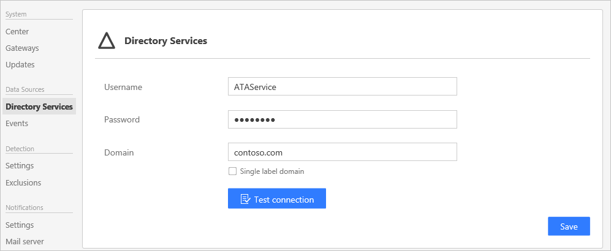

*S’applique à : Advanced Threat Analytics version 1.8*

# Modifier la configuration ATA - Mot de passe de connectivité de domaine

## Modifier le mot de passe de connectivité de domaine
Si vous modifiez le mot de passe de connectivité de domaine, assurez-vous que le mot de passe entré est correct. Dans le cas contraire, le service de passerelle ATA cesse de fonctionner sur les passerelles ATA.

Si vous pensez que cela s’est produit, recherchez les erreurs suivantes dans le fichier Microsoft.Tri.Gateway-Errors.log sur la passerelle ATA : `The supplied credential is invalid.`

Pour corriger ce problème, procédez comme suit pour mettre à jour le mot de passe de connectivité de domaine dans le centre ATA :

1.  Ouvrez la console ATA dans le centre ATA.

2.  Sélectionnez l’option des paramètres dans la barre d’outils, puis **Configuration**.

    

3.  Sélectionnez **Services d’annuaire**.

    

4.  Sous **Mot de passe**, modifiez le mot de passe.

    Si le centre ATA dispose d’une connectivité au domaine, utilisez le bouton **Tester la connexion** pour valider les informations d’identification

5.  Cliquez sur **Enregistrer**.

6.  Après avoir modifié le mot de passe, vérifiez manuellement que le service de la passerelle ATA fonctionne sur les serveurs de la passerelle ATA.

## Voir aussi
- [Utilisation de la console ATA](working-with-ata-console.md)
- [Consultez le forum ATA !](https://social.technet.microsoft.com/Forums/security/home?forum=mata)
