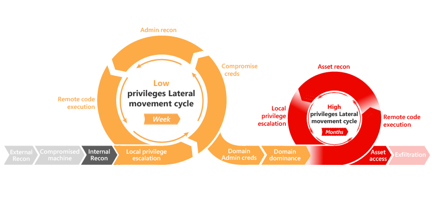

*S’applique à : Advanced Threat Analytics version 1.8*

# Introduction

ATA fournit une fonctionnalité de détection pour les différentes phases d’une attaque avancée : reconnaissance, compromission des informations d’identification, mouvement latéral, élévation des privilèges, contrôle du domaine, etc.

Les phases de la « kill-chain » dans lesquelles ATA fournit actuellement une détection sont mises en surbrillance dans l’image ci-dessous.

Cet article fournit des détails sur chaque activité suspecte par phase.

## Reconnaissance à l’aide de l’énumération de compte

> [!div class="mx-tableFixed"]
| Description|Examen|Recommandation|Gravité|
|------|----|------|----------|
| L’attaque de l’énumération de compte est une technique que les attaquants utilisent pour deviner différents noms de compte par des tentatives d’authentification Kerberos, afin de détecter si un utilisateur existe sur le réseau. Les comptes devinés peuvent être utilisés dans les étapes suivantes de l’attaque. | Examinez l’ordinateur en question et essayez de déterminer s’il existe une raison légitime aux nombreux processus d’authentification Kerberos observés. Il s’agit de processus qui ont essayé sans succès d’apprendre plusieurs comptes, car l’utilisateur n’existe pas, (erreur Client_Principal_Unknown) et pour lesquels au moins une tentative d’accès a réussi.   **Exceptions :** Cette détection s’appuie sur la recherche de plusieurs comptes non existants et sur une tentative d’authentification à partir d’un seul ordinateur. Si un utilisateur fait une erreur en tapant manuellement un nom d’utilisateur ou un domaine, la tentative d’authentification est considérée comme une tentative de connexion à un compte non existant. Les serveurs Terminal Server qui impliquent la connexion de nombreux utilisateurs risquent légitimement d’avoir un grand nombre de tentatives de connexion erronée. |Examinez le processus chargé de générer ces demandes.  Pour identifier les processus en fonction du port source, consultez [Have you ever wanted to see which Windows process sends a certain packet out to network?](https://blogs.technet.microsoft.com/nettracer/2010/08/02/have-you-ever-wanted-to-see-which-windows-process-sends-a-certain-packet-out-to-network/) (N’avez-vous jamais voulu savoir quel processus Windows envoie tel paquet sur le réseau ?)|Moyenne|

## Reconnaissance à l’aide de l’énumération des services d’annuaire (SAM-R)

> [!div class="mx-tableFixed"]
| Description|Examen|Recommandation|Gravité|
|------|----|------|----------|
| La reconnaissance des services d’annuaire est une technique que les attaquants utilisent pour mapper la structure d’annuaire et cibler des comptes privilégiés pour les étapes suivantes de l’attaque. Le protocole SAM-R (Security Account Manager Remote) est l’une des méthodes utilisées pour interroger l’annuaire. | Déterminez pourquoi l’ordinateur en question exécute un protocole MS-SAMR. Si le protocole est exécuté de manière anormale, il interroge probablement des entités sensibles.   **Exceptions :** Cette détection s’appuie sur le profilage du comportement normal des utilisateurs qui exécutent des requêtes SAM-R et vous alerte quand une requête anormale est observée. Les utilisateurs sensibles qui se connectent à des ordinateurs qui ne leur appartiennent pas peuvent déclencher une requête SAM-R détectée comme étant anormale, même si elle fait partie du processus de travail normal. Cela arrive souvent aux membres de l’équipe informatique. Si ces requêtes sont marquées comme suspectes, mais qu’elles sont le résultat d’une utilisation normale, c’est parce que le comportement n’a pas déjà été observé par ATA. | Dans ce cas, il est recommandé de prolonger la période d’apprentissage et d’améliorer la couverture d’ATA dans le domaine, par forêt Active Directory.  [Téléchargez et exécutez l’outil « SAMRi10 »](https://gallery.technet.microsoft.com/SAMRi10-Hardening-Remote-48d94b5b). SAMRi10 a été publié par l’équipe ATA pour renforcer la protection de votre environnement contre les requêtes SAM-R. | Moyenne|

## Reconnaissance à l’aide de DNS

> [!div class="mx-tableFixed"]
| Description|Examen|Recommandation|Gravité|
|------|----|------|----------|
| Votre serveur DNS contient un plan de tous les ordinateurs, les adresses IP et les services de votre réseau. Ces informations sont utilisées par les attaquants pour mapper la structure de votre réseau et cibler les ordinateurs intéressants pour les étapes suivantes de l’attaque. | Déterminez pourquoi l’ordinateur en question exécute une requête AXFR (Full Transfer Zone) pour obtenir tous les enregistrements du domaine DNS.   **Exceptions :** Cette détection identifie les serveurs non-DNS qui envoient des demandes de transfert de zone DNS. Plusieurs solutions d’analyse de sécurité sont connues pour envoyer ce type de demandes aux serveurs DNS.   Vérifiez également qu’ATA est en mesure de communiquer via le port 53 à partir des passerelles ATA vers les serveurs DNS afin d’éviter les faux positifs.| Limitez les transferts de zone en choisissant avec soin les hôtes qui peuvent en faire la demande. Pour plus d’informations, consultez [Sécurisation de DNS](https://technet.microsoft.com/library/cc770474(v=ws.11).aspx) et [Liste de vérification : sécuriser votre serveur DNS](https://technet.microsoft.com/library/cc770432(v=ws.11).aspx). |Moyenne|

## Reconnaissance à l’aide de l’énumération de sessions SMB

> [!div class="mx-tableFixed"]
| Description|Examen|Recommandation|Gravité|
|------|----|------|----------|
| L’énumération SMB (Server Message Block) permet aux attaquants d’obtenir des informations sur les adresses IP à partir desquelles les utilisateurs se connectent à votre réseau. Une fois que les attaquants ont ces informations, ils peuvent les utiliser pour cibler des comptes spécifiques et se déplacer latéralement sur le réseau. | Déterminez pourquoi l’ordinateur en question effectue des énumérations de sessions SMB.  **Exceptions :** Cette détection s’appuie sur l’hypothèse que l’énumération de sessions SMB n’est pas justifiée dans un réseau d’entreprise, mais certaines solutions d’analyse de sécurité (par exemple, Websense) envoient ce type de demandes. | [Utilisez l’outil Net Cease pour renforcer la sécurité de votre environnement](https://gallery.technet.microsoft.com/Net-Cease-Blocking-Net-1e8dcb5b) | Moyenne   |

## Force brute (LDAP, Kerberos, NTLM)

> [!div class="mx-tableFixed"]
| Description|Examen|Recommandation|Gravité|
|------|----|------|----------|
| Dans une attaque par force brute, l’attaquant essaie plusieurs mots de passe pour tenter de deviner le bon. Il vérifie systématiquement tous les mots de passe possibles (ou un grand nombre de mots de passe possibles) jusqu'à ce qu’il trouve celui qui convient. Quand il devine le mot de passe, il peut se connecter au réseau comme s’il était l’utilisateur. ATA prend actuellement en charge l’attaque horizontale par force brute (plusieurs comptes) à l’aide du protocole Kerberos ou NTLM, et les attaques verticale et horizontale (compte unique, plusieurs essais de mot de passe) à l’aide d’une liaison simple LDAP. | Déterminez pourquoi l’ordinateur en question ne parvient pas à authentifier plusieurs comptes d’utilisateur (avec à peu près le même nombre de tentatives d’authentification pour plusieurs utilisateurs) ou pourquoi un grand nombre d’échecs d’authentification s’est produit pour un même utilisateur.   **Exceptions :** Cette détection s’appuie sur le profilage du comportement normal des comptes qui s’authentifient à différentes ressources et une alerte est déclenchée quand un modèle anormal est observé. Ce modèle n’est pas rare dans les scripts qui s’authentifient automatiquement, mais peuvent utiliser des informations d’identification obsolètes (autrement dit, un mot de passe ou un nom d’utilisateur incorrect). | Les mots de passe longs et complexes assurent le niveau minimum de sécurité nécessaire contre les attaques par force brute. | Moyenne   |

## Compte sensible exposé par l’authentification en texte brut et Service exposant des comptes par l’authentification en texte brut

> [!div class="mx-tableFixed"]
| Description|Examen|Recommandation|Gravité|
|------|----|------|----------|
| Certains services sur un ordinateur envoient les informations d’identification en texte brut, même pour les comptes sensibles. L’attaquant qui surveille votre trafic peut intercepter et récupérer ces informations d’identification à des fins malveillantes. Tout mot de passe en texte clair d’un compte sensible déclenche l’alerte. | Recherchez l’ordinateur concerné et déterminez pourquoi il utilise des liaisons simples LDAP. | Vérifiez la configuration des ordinateurs sources et que vous n’utilisez pas de liaison simple LDAP. Sinon, remplacez les liaisons simples LDAP par LDAP SALS ou LDAPS. Appliquez un framework à plusieurs niveaux de sécurité et limitez l’accès aux niveaux pour empêcher une élévation de privilèges. | Faible pour le service exposant, Moyenne pour les comptes sensibles |

## Activités suspectes liées à un compte honeytoken

> [!div class="mx-tableFixed"]
| Description|Examen|Recommandation|Gravité|
|------|----|------|----------|
| Les comptes Honeytoken sont des comptes servant de leurre pour piéger, identifier et suivre l’activité malveillante sur le réseau qui implique ces comptes. Ce sont des comptes qui ne sont pas utilisés et qui dorment sur votre réseau. Si un compte Honeytoken devient soudainement actif, ce peut être le signe qu’un utilisateur malveillant tente d’utiliser ce compte. | Déterminez pourquoi un compte Honeytoken s’authentifie à partir de cet ordinateur. | Parcourez les pages de profil ATA des autres comptes sensibles (avec élévation de privilèges) de votre environnement pour voir s’il existe des activités potentiellement suspectes. | Moyenne   |

## Implémentation de protocole inhabituelle

> [!div class="mx-tableFixed"]
| Description|Examen|Recommandation|Gravité|
|------|----|------|----------|
| Les attaquants peuvent utiliser des outils qui implémentent des protocoles SMB/Kerberos de façon à pouvoir obtenir des fonctionnalités sur votre réseau. Ce comportement est révélateur des techniques utilisées dans les attaques par force brute ou les attaques over-pass-the-hash. | Déterminez pourquoi l’ordinateur en question utilise un protocole d’authentification ou un protocole SMB de façon inhabituelle.   **Exceptions :** Cette détection peut être déclenchée dans de rares cas quand des outils légitimes sont utilisés pour implémenter les protocoles de manière non standard. Certaines applications de test du stylet sont connues pour ça. | Capturez le trafic réseau et identifiez le processus qui génère le trafic avec l’implémentation de protocole inhabituelle.  Pour déterminer s’il s’agit d’une attaque WannaCry, procédez comme suit :   1.   Téléchargez l’exportation Excel de l’activité suspecte.  
2.  Ouvrez l’onglet d’activité réseau et accédez au champ « Json » pour copier les fichiers JSON associés Smb1SessionSetup et Ntlm  
3.  Si Smb1SessionSetup.OperatingSystem a la valeur « Windows 2000 2195 », Smb1SessionSetup.IsEmbeddedNtlm a la valeur « true » et Ntlm.SourceAccountId a la valeur « null », il s’agit de WannaCry.
| Moyenne |

## Demande d’information privée de protection contre les données malveillantes

> [!div class="mx-tableFixed"]
| Description|Examen|Recommandation|Gravité|
|------|----|------|----------|
| L’API de protection des données (DPAPI) est utilisée par plusieurs composants de Windows pour stocker de façon sécurisée les mots de passe, les clés de chiffrement et d’autres données sensibles. Les contrôleurs de domaine détiennent une clé principale de sauvegarde qui peut être utilisée pour déchiffrer tous les secrets chiffrés avec DPAPI par des ordinateurs Windows joints à un domaine. L’attaquant peut utiliser la clé principale de sauvegarde de domaine DPAPI pour déchiffrer tous les secrets de tous les ordinateurs joints à un domaine (mots de passe de navigateur, fichiers chiffrés, etc.). | Déterminez pourquoi l’ordinateur a demandé la clé principale de DPAPI à l’aide de cet appel d’API non documenté. | Découvrez plus d’informations sur DPAPI dans [Windows Data Protection](https://msdn.microsoft.com/library/ms995355.aspx) (Protection des données Windows). | Importante     |

## Suspicion d’usurpation d’identité basée sur un comportement inhabituel

> [!div class="mx-tableFixed"]
| Description|Examen|Recommandation|Gravité|
|------|----|------|----------|
| Une fois que vous avez généré un modèle de comportement (au moins 50 comptes actifs sur 3 semaines sont nécessaires pour générer un modèle de comportement), tout comportement anormal déclenche une alerte. Le comportement qui ne correspond pas au modèle généré pour un compte d’utilisateur spécifique peut indiquer une usurpation d’identité. | Déterminez pourquoi l’utilisateur en question se comporte différemment.   **Exceptions :** Si ATA a uniquement une couverture partielle (tous les contrôleurs de domaine ne sont pas routés vers une passerelle ATA), seule une activité partielle est apprise pour un utilisateur spécifique. Si après de plus de 3 semaines, ATA commence subitement à couvrir tout le trafic, une activité complète de l’utilisateur peut entraîner le déclenchement de l’alerte. | Vérifiez qu’ATA est déployé sur tous vos contrôleurs de domaine.   1.  Vérifiez si l’utilisateur a changé de poste dans l’organisation.  2.  Vérifiez si l’utilisateur est un travailleur intérimaire.  3.  Vérifiez si l’utilisateur vient de rentrer après une longue absence.| Moyenne pour tous les utilisateurs et Haute pour les utilisateurs sensibles |

## Pass-the-Ticket

> [!div class="mx-tableFixed"]
| Description|Examen|Recommandation|Gravité|
|------|----|------|----------|
| L’attaque Pass-the-Ticket est une technique de mouvement latéral par laquelle les attaquants volent un ticket Kerberos sur un ordinateur et l’utilisent pour accéder à un autre ordinateur en se faisant passer pour une entité de votre réseau. | Cette détection s’appuie sur l’utilisation des mêmes tickets Kerberos sur au moins deux ordinateurs différents. Dans certains cas, si vos adresses IP changent rapidement, ATA peut ne pas pouvoir déterminer si les différentes adresses IP sont utilisées par le même ordinateur ou par différents ordinateurs. Il s’agit d’un problème courant avec les pools DHCP de taille réduite (VPN, Wi-Fi, etc.) et les adresses IP partagées (périphériques NAT). | Appliquez un framework à plusieurs niveaux de sécurité et limitez l’accès aux niveaux pour empêcher une élévation de privilèges. | Importante     |

## Pass-the-Hash

> [!div class="mx-tableFixed"]
| Description|Examen|Recommandation|Gravité|
|------|----|------|----------|
| Dans une attaque pass-the-hash, l’attaquant s’authentifie sur un serveur ou un service distant à l’aide du hachage NTLM sous-jacent du mot de passe d’un utilisateur au lieu du mot de passe en texte clair associé, comme c’est normalement le cas. | Vérifiez si le compte a eu une activité anormale avant ou après cette alerte. | Appliquez les recommandations décrites dans [Pass the Hash](http://aka.ms/PtH). Appliquez un framework à plusieurs niveaux de sécurité et limitez l’accès aux niveaux pour empêcher une élévation de privilèges. | Importante|

## Overpass-the-Hash

> [!div class="mx-tableFixed"]
| Description|Examen|Recommandation|Gravité|
|------|----|------|----------|
| Une attaque Over-pass-the-hash exploite une faiblesse d’implémentation dans le protocole d’authentification Kerberos, où un hachage NTLM est utilisé pour créer un ticket Kerberos, ce qui permet à l’attaquant de s’authentifier auprès des services du réseau sans le mot de passe de l’utilisateur. | Passage à une version antérieure du chiffrement : déterminez pourquoi le compte en question utilise RC4 dans Kerberos après avoir appris à utiliser AES.   **Exceptions :** Cette détection s’appuie le profilage des méthodes de chiffrement utilisées dans le domaine et vous alerte si une méthode anormale et plus faible est observée. Dans certains cas, une méthode de chiffrement plus faible est utilisée et ATA la détecte comme anormale, alors qu’elle peut faire partie de votre processus de travail normal (même si cela est rare). Cela peut se produire quand ce type de comportement n’a pas déjà été observé par ATA. Une meilleure couverture d’ATA dans le domaine peut aider à éviter cette situation. | Appliquez les recommandations décrites dans [Pass the Hash](http://aka.ms/PtH). Appliquez un framework à plusieurs niveaux de sécurité et limitez l’accès aux niveaux pour empêcher une élévation de privilèges. | Importante     |

## Élévation de privilège à l’aide de données d’autorisation falsifiées (Code malveillant exploitant une faille de sécurité MS14-068 (faux PAC) / Code malveillant exploitant une faille de sécurité MS11-013 (Silver PAC))

> [!div class="mx-tableFixed"]
| Description|Examen|Recommandation|Gravité|
|------|----|------|----------|
| Des vulnérabilités connues dans les versions antérieures de Windows Server permettent aux attaquants de manipuler le certificat PAC (Privileged Attribute Certificate), un champ dans le ticket Kerberos qui contient les données d’autorisation de l’utilisateur (dans Active Directory, il s’agit de l’appartenance au groupe), et de lui accorder des privilèges supplémentaires. | Vérifiez si un service spécial est en cours d’exécution sur l’ordinateur concerné et s’il utilise une autre méthode d’autorisation que PAC.   **Exceptions :** Dans certains scénarios, les ressources implémentent leur propre mécanisme d’autorisation et peuvent déclencher une alerte dans ATA. | Vérifiez que tous les contrôleurs de domaine avec une version de système d’exploitation antérieure ou égale à Windows Server 2012 R2 sont installés avec [KB3011780](https://support.microsoft.com/help/2496930/ms11-013-vulnerabilities-in-kerberos-could-allow-elevation-of-privilege) et que tous les serveurs et contrôleurs de domaine membres avec une version antérieure ou égale à 2012 R2 sont à jour avec KB2496930. Pour plus d’informations, consultez [Silver PAC](https://technet.microsoft.com/library/security/ms11-013.aspx) et [faux PAC](https://technet.microsoft.com/library/security/ms14-068.aspx). | Importante     |

## Modification anormale de groupes sensibles

> [!div class="mx-tableFixed"]
| Description|Examen|Recommandation|Gravité|
|------|----|------|----------|
| Des vulnérabilités connues dans les versions antérieures de Windows Server permettent aux attaquants de manipuler le certificat PAC (Privileged Attribute Certificate), un champ dans le ticket Kerberos qui contient les données d’autorisation de l’utilisateur (dans Active Directory, il s’agit de l’appartenance au groupe), et de lui accorder des privilèges supplémentaires. | Vérifiez que le changement de groupe est légitime.   **Exceptions :** Cette détection s’appuie sur le profilage du comportement normal des utilisateurs qui modifient des groupes sensibles et vous alerte quand un changement anormal est observé. Des modifications légitimes peuvent déclencher une alerte quand ce type de comportement n’a pas déjà été observé par ATA. Une période d’apprentissage plus longue et une meilleure couverture d’ATA dans votre domaine peuvent aider à éviter cette situation. | Réduisez le groupe de personnes autorisées à modifier les groupes sensibles. Utilisez des autorisations juste-à-temps si possible. | Moyenne   |

## Passage à une version antérieure du chiffrement - Programme malveillant Skeleton Key

> [!div class="mx-tableFixed"]
| Description|Examen|Recommandation|Gravité|
|------|----|------|----------|
| Skeleton Key est un programme malveillant qui s’exécute sur les contrôleurs de domaine et autorise l’authentification sur le domaine de n’importe quel compte sans connaître son mot de passe. Ce programme malveillant utilise souvent des algorithmes de chiffrement plus faibles pour chiffrer les mots de passe de l’utilisateur sur le contrôleur de domaine. | Passage à une version antérieure du chiffrement : déterminez pourquoi le compte en question utilise RC4 dans Kerberos après avoir appris à utiliser AES.   **Exceptions :** Cette détection s’appuie sur le profilage des méthodes de chiffrement utilisées dans le domaine. Dans certains cas, une méthode de chiffrement plus faible est utilisée et ATA la détecte comme anormale, alors qu’elle fait partie (même si cela est rare) du processus de travail normal. | Vous pouvez vérifier si Skeleton Key a affecté vos contrôleurs de domaine à l’aide de [l’analyseur écrit par l’équipe ATA](https://gallery.technet.microsoft.com/Aorato-Skeleton-Key-24e46b73). | Importante |

## Golden Ticket

> [!div class="mx-tableFixed"]
| Description|Examen|Recommandation|Gravité|
|------|----|------|----------|
| Si l’attaquant a des droits d’administrateur de domaine, il peut créer un ticket TGT (ticket granting ticket) Kerberos qui fournit une autorisation pour toutes les ressources du réseau et définit l’heure d’expiration du ticket sur la valeur de son choix. De cette façon, l’attaquant obtient une certaine persistance dans le réseau. | Passage à une version antérieure du chiffrement : déterminez pourquoi le compte en question utilise RC4 dans Kerberos après avoir appris à utiliser AES.   **Exceptions :** Cette détection s’appuie le profilage des méthodes de chiffrement utilisées dans le domaine et envoie une alerte si une méthode anormale et plus faible est observée. Dans certains cas, une méthode de chiffrement plus faible est utilisée et ATA la détecte comme anormale, alors qu’elle fait partie (même si cela est rare) du processus de travail normal. Cela peut se produire quand ce type de comportement n’a pas déjà été observé par ATA. Vérifiez qu’ATA a une couverture complète sur votre domaine. | Conservez le ticket TGT Kerberos (KRBTGT) de la clé principale de manière aussi sécurisée que possible, comme suit :  1.  Sécurité physique  2.  Sécurité physique des machines virtuelles  3. Renforcer la sécurité des contrôleurs de domaine  4.  Isolation de l’autorité de sécurité locale (LSA)/Credential Guard  Si des golden tickets sont détectés, un examen approfondi doit être effectué pour évaluer la nécessité d’une récupération tactique.  Changez le ticket KRBTGT deux fois régulièrement selon les instructions de l’article du [blog Microsoft, KRBTGT Account Password Reset Scripts now available for customers](https://blogs.microsoft.com/microsoftsecure/2015/02/11/krbtgt-account-password-reset-scripts-now-available-for-customers/) (Scripts de réinitialisation du mot de passe du compte KRBTGT maintenant disponibles pour les clients), à l’aide [l’outil de réinitialisation du mot de passe/des clés du compte KRBTGT](https://gallery.technet.microsoft.com/Reset-the-krbtgt-account-581a9e51).   Implémentez ces [recommandations Pass-the-hash](http://aka.ms/PtH). | Moyenne   |

## Exécution à distance

> [!div class="mx-tableFixed"]
| Description|Examen|Recommandation|Gravité|
|------|----|------|----------|
| Les attaquants qui accèdent aux informations d’identification d’administrateur peuvent exécuter des commandes à distance sur votre contrôleur de domaine. Cela peut servir pour obtenir une persistance, collecter des informations, lancer des attaques par déni de service (DOS) ou toute autre raison. | Déterminez si le compte en question est autorisé à effectuer cette exécution à distance sur votre contrôleur de domaine.   **Exceptions :** Les utilisateurs légitimes qui exécutent parfois des commandes sur le contrôleur de domaine peuvent déclencher cette alerte, bien qu’elle fasse partie du processus normal d’administration. Cela arrive plus souvent aux membres de l’équipe informatique ou aux comptes de service qui effectuent des tâches d’administration sur les contrôleurs de domaine. | Limitez l’accès à distance aux contrôleurs de domaine à partir d’ordinateurs qui ne sont pas de niveau 0. Supprimez tous les dossiers et fichiers suspects, obsolètes et superflus. Implémentez des stratégies de contrôle de compte d’utilisateur (UAC) fortes. Implémentez des [PAW](https://technet.microsoft.com/en-us/windows-server-docs/security/securing-privileged-access/securing-privileged-access) pour autoriser uniquement les ordinateurs avec une sécurité renforcée à se connecter aux contrôleurs de domaine pour les administrateurs. | Faible      |

## Demandes de réplication malveillantes

> [!div class="mx-tableFixed"]
| Description|Examen|Recommandation|Gravité|
|------|----|------|----------|
| La réplication Active Directory est le processus par lequel les modifications apportées à un contrôleur de domaine sont synchronisées avec tous les autres contrôleurs de domaine du domaine ou de la forêt qui stockent des copies des mêmes données. Quand l’attaquant a l’autorisation appropriée, il peut lancer une demande de réplication en se faisant passer pour un contrôleur de domaine, ce qui lui permet de récupérer les données stockées dans Active Directory, y compris les hachages de mot de passe. | Déterminez pourquoi l’ordinateur utilise l’API de réplication de contrôleur de domaine. Cette détection s’appuie sur le fait qu’ATA utilise la partition de configuration de la forêt Active Directory pour déterminer si un ordinateur est un contrôleur de domaine.   **Exceptions :** La synchronisation d’annuaires Azure AD peut entraîner le déclenchement de cette alerte. | Validez les autorisations suivantes : - Répliquer les modifications d’annuaire   -   Répliquer les modifications d'annuaire  Pour plus d’informations, consultez [Accorder des autorisations Active Directory Domain Services pour la synchronisation de profils dans SharePoint Server 2013](https://technet.microsoft.com/library/hh296982.aspx)  Vous pouvez utiliser [l’analyseur ACL AD](https://blogs.technet.microsoft.com/pfesweplat/2013/05/13/take-control-over-ad-permissions-and-the-ad-acl-scanner-tool/) ou créer un script PowerShell pour déterminer qui, dans le domaine, a ces autorisations. | Moyenne   |

## Relation de confiance rompue entre le domaine et les ordinateurs

> [!div class="mx-tableFixed"]
| Description|Examen|Recommandation|Gravité|
|------|----|------|----------|
| Une relation de confiance rompue signifie que les exigences de sécurité Active Directory ne peuvent pas être appliquées. Cela est souvent considéré comme un échec de référence en matière de sécurité et de conformité, et une cible facile pour les attaquants. Cette faille déclenche une alerte dans ATA si plus de 5 échecs consécutifs de l’authentification Kerberos sont observés pour un compte d’ordinateur dans un intervalle de 24 heures. Comme l’ordinateur ne communique pas avec le contrôleur de domaine, (1) la stratégie de groupe n’est pas mise à jour et (2) la connexion est limitée aux informations d’identification mises en cache. | Vérifiez l’état de la relation de confiance entre l’ordinateur et le domaine en consultant les journaux des événements. | Rattachez l’ordinateur au domaine, si nécessaire, ou réinitialisez le mot de passe de l’ordinateur. | Faible      |

## Suppression massive d’objets

> [!div class="mx-tableFixed"]
| Description|Examen|Recommandation|Gravité|
|------|----|------|----------|
| ATA lève cette alerte quand plus de 5 % de tous les comptes sont supprimés. Cela implique l’accès en lecture sur le conteneur des éléments supprimés. | Déterminez pourquoi 5 % de tous vos comptes ont soudainement été supprimés. | Supprimez les autorisations des utilisateurs qui peuvent supprimer des comptes dans Active Directory. Pour plus d’informations, consultez [View or Set Permissions on a Directory Object](https://technet.microsoft.com/library/cc816824%28v=ws.10%29.aspx) (Afficher ou définir des autorisations sur un objet d’annuaire). | Faible |

## Voir aussi
- [Gestion des activités suspectes](working-with-suspicious-activities.md)
- [Examen des attaques à l’aide d’un faux PAC](use-case-forged-pac.md)
- [Résolution des problèmes connus d’ATA](troubleshooting-ata-known-errors.md)
- [Consultez le forum ATA !](https://social.technet.microsoft.com/Forums/security/home?forum=mata)
