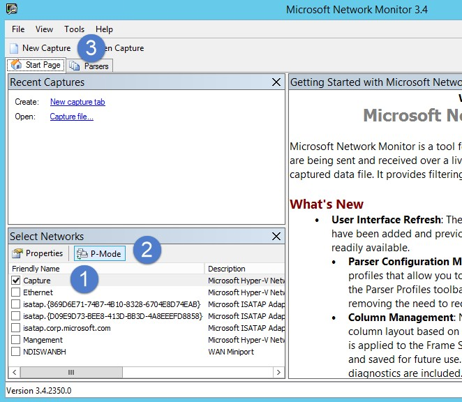

*S’applique à : Advanced Threat Analytics version 1.8*

# Valider la mise en miroir des ports

> [!NOTE] 
> Cet article ne vous concerne que si vous déployez des passerelles ATA au lieu de passerelles légères ATA. Pour déterminer si vous devez utiliser des passerelles ATA, consultez [Choix des passerelles appropriées pour votre déploiement](ata-capacity-planning.md#choosing-the-right-gateway-type-for-your-deployment).
 
Les étapes suivantes sont conçues pour vous guider dans le processus de validation de la mise en miroir des ports. Pour qu’ATA fonctionne correctement, la passerelle ATA doit pouvoir voir le trafic entrant et sortant du contrôleur de domaine. La principale source de données utilisée par ATA est l’inspection approfondie des paquets du trafic réseau entrant et sortant de vos contrôleurs de domaine. Pour qu’ATA puisse voir le trafic réseau, vous devez configurer la mise en miroir des ports. La mise en miroir des ports copie le trafic d’un port (le port source) vers un autre port (le port de destination).

## Valider la mise en miroir de port à l’aide d’un script Windows PowerShell

1. Enregistrez le texte de ce script dans un fichier nommé *ATAdiag.ps1*.
2. Exécutez ce script sur la passerelle ATA que vous souhaitez valider.
Le script génère un trafic ICMP depuis la passerelle ATA vers le contrôleur de domaine et recherche ce trafic sur la carte de capture réseau sur le contrôleur de domaine.
Si la passerelle ATA constate que le trafic ICMP a comme adresse IP de destination l’adresse IP du contrôleur de domaine que vous avez entrée dans la console ATA, elle considère que la mise en miroir de port est configurée. 

Exemple d’exécution du script :

    # ATAdiag.ps1 -CaptureIP n.n.n.n -DCIP n.n.n.n -TestCount n
    
    param([parameter(Mandatory=$true)][string]$CaptureIP, [parameter(Mandatory=$true)][string]$DCIP, [int]$PingCount = 10)

    # Set variables
    
        $ErrorActionPreference = "stop"
    $starttime = get-date
    $byteIn = new-object byte[] 4
    $byteOut = new-object byte[] 4
    $byteData = new-object byte[] 4096  # size of data
    
    $byteIn[0] = 1  # for promiscuous mode
    $byteIn[1-3] = 0
    $byteOut[0-3] = 0

    # Convert network data to host format
        function NetworkToHostUInt16 ($value)
        {
        [Array]::Reverse($value)
        [BitConverter]::ToUInt16($value,0)
        }
    
    function NetworkToHostUInt32 ($value)
        {
        [Array]::Reverse($value)
        [BitConverter]::ToUInt32($value,0)
        }
    
    function ByteToString ($value)
        {
        $AsciiEncoding = new-object system.text.asciiencoding
        $AsciiEncoding.GetString($value)
            }
    
    Write-Host "Testing Port Mirroring..." -ForegroundColor Yellow
    Write-Host ""
    Write-Host "Here is a summary of the connection we will test." -ForegroundColor Yellow

    # Initialize a first ping connection
    Test-Connection -Count 1 -ComputerName $DCIP -ea SilentlyContinue
    Write-Host ""
    
    Write-Host "Press any key to continue..." -ForegroundColor Red
    [void][System.Console]::ReadKey($true)
    Write-Host ""
    Write-Host "Sending ICMP and Capturing data..." -ForegroundColor Yellow
    
    # Open a socket
    
    $socket = new-object system.net.sockets.socket([Net.Sockets.AddressFamily]::InterNetwork,[Net.Sockets.SocketType]::Raw,[Net.Sockets.ProtocolType]::IP)
    
    # Include the IP header
    $socket.setsocketoption("IP","HeaderIncluded",$true)
    
    $socket.ReceiveBufferSize = 10000
    
    $ipendpoint = new-object system.net.ipendpoint([net.ipaddress]"$CaptureIP",0)
    $socket.bind($ipendpoint)
    
    # Enable promiscuous mode
    [void]$socket.iocontrol([net.sockets.iocontrolcode]::ReceiveAll,$byteIn,$byteOut)
    
    # Initialize test variables
    $tests = 0
    $TestResult = "Noise"
    $OneSuccess = 0
    
    while ($tests -le $PingCount)
        {
        if (!$socket.Available)  # see if any packets are in the queue
            {
            start-sleep -milliseconds 500
            continue
            }
    
    # Capture traffic
        $rcv = $socket.receive($byteData,0,$byteData.length,[net.sockets.socketflags]::None)
    
    # Decode the header so we can read ICMP
    
        $MemoryStream = new-object System.IO.MemoryStream($byteData,0,$rcv)
        $BinaryReader = new-object System.IO.BinaryReader($MemoryStream)
    
    # Set IP version & header length
        $VersionAndHeaderLength = $BinaryReader.ReadByte()
    
        # TOS
        $TypeOfService= $BinaryReader.ReadByte()
    
        # More values, and the Protocol Number for ICMP traffic
        # Convert network format of big-endian to host format of little-endian 
        $TotalLength = NetworkToHostUInt16 $BinaryReader.ReadBytes(2)
    
        $Identification = NetworkToHostUInt16 $BinaryReader.ReadBytes(2)
        $FlagsAndOffset = NetworkToHostUInt16 $BinaryReader.ReadBytes(2)
        $TTL = $BinaryReader.ReadByte()
        $ProtocolNumber = $BinaryReader.ReadByte()
        $Checksum = [Net.IPAddress]::NetworkToHostOrder($BinaryReader.ReadInt16())
    
        # The source and destination IP addresses
        $SourceIPAddress = $BinaryReader.ReadUInt32()
        $DestinationIPAddress = $BinaryReader.ReadUInt32()
    
        # The source and destimation ports
        $sourcePort = [uint16]0
        $destPort = [uint16]0
            
        # Close the stream reader
        $BinaryReader.Close()
        $memorystream.Close()
    
        # Cast DCIP into an IPaddress type
        $DCIPP = [ipaddress] $DCIP
        $DestinationIPAddressP = [ipaddress] $DestinationIPAddress
    
        #Ping the DC at the end after starting the capture
        Test-Connection -Count 1 -ComputerName $DCIP -ea SilentlyContinue | Out-Null
            
        # This is the match logic - check to see if Destination IP from the Ping sent matches the DCIP entered by in the ATA Console  
        # The only way the ATA Gateway should see a destination of the DC is if Port Spanning is configured
        
            if ($DestinationIPAddressP -eq $DCIPP)  # is the destination IP eq to the DC IP? 
            {
            $TestResult = "Port Spanning success!"
            $OneSuccess = 1
            } else {
                $TestResult = "Noise"
            }
        
        # Put source, destination, test result in Powershell object
        
        new-object psobject | add-member -pass noteproperty CaptureSource $([system.net.ipaddress]$SourceIPAddress) | add-member -pass noteproperty CaptureDestination $([system.net.ipaddress]$DestinationIPAddress) | Add-Member -pass NoteProperty Result $TestResult | Format-List | Out-Host
        #Count tests
        $tests ++
        }
    
        If ($OneSuccess -eq 1){
            Write-Host "Port Spanning Success!" -ForegroundColor Green
            Write-Host ""
            Write-Host "At least one packet which was addressed to the DC, was picked up by the Gateway." -ForegroundColor Yellow
            Write-Host "A little noise is OK, but if you don't see a majority of successes, you might want to re-run." -ForegroundColor Yellow
        } Else {
            Write-Host "No joy, all noise.  You may want to re-run, increase the number of Ping Counts, or check your config." -ForegroundColor Red
        }
    
    Write-Host ""
    Write-Host "Press any key to continue..." -ForegroundColor Red
    [void][System.Console]::ReadKey($true)
    
    
## Valider la mise en miroir à l’aide du Moniteur réseau

1.  Installez [Microsoft Network Monitor 3.4](http://www.microsoft.com/download/details.aspx?id=4865) sur la passerelle ATA que vous souhaitez valider.

    > [!IMPORTANT]
    > N’installez pas l’analyseur de message Microsoft ou tout autre logiciel de capture du trafic sur la passerelle ATA.

2.  Ouvrez le Moniteur réseau et créez un nouvel onglet de capture.

    1.  Sélectionnez uniquement la carte réseau **Capture** ou celle qui est connectée au port de commutateur qui est configuré comme le port de destination de la mise en miroir.

    2.  Assurez-vous que le mode P est activé.

    3.  Cliquez sur **Nouvelle capture**.

        

3.  Dans la fenêtre Filtre d’affichage, entrez le filtre **KerberosV5 OR LDAP**, puis cliquez sur **Appliquer**.

    

4.  Pour démarrer la session de capture, cliquez sur **Démarrer**. Si vous ne voyez pas le trafic entrant et sortant du contrôleur de domaine, examinez la configuration de mise en miroir des ports.

    

    > [!NOTE]
    > Il est important de vous assurer que vous voyez le trafic entrant et sortant des contrôleurs de domaine.
    

5.  Si vous voyez uniquement le trafic dans un sens, vous devez résoudre ce problème de configuration de la mise en miroir des ports avec l’aide de l’équipe chargée du réseau ou de la virtualisation.

## Voir aussi

- [Configurer la mise en miroir des ports](configure-port-mirroring.md)
- [Consultez le forum ATA !](https://social.technet.microsoft.com/Forums/security/home?forum=mata)
