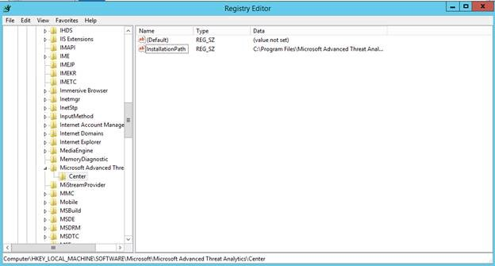
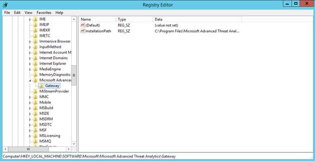

# Nouveautés d’ATA version 1.4
Ces notes de publication fournissent des informations sur les problèmes connus de la version 1.4 d’Advanced Threat Analytics.

## Nouveautés de cette version

-   Prise en charge du transfert d’événements Windows pour envoyer les événements directement à partir des contrôleurs de domaine vers la passerelle ATA

-   Amélioration de la détection Pass-The-Hash pour les ressources d’entreprise grâce à la combinaison de l’inspection approfondie des paquets et des journaux des événements Windows

-   Amélioration de la détection et de la visibilité des appareils non joints à un domaine et des appareils non Windows

-   Amélioration des performances afin de permettre un trafic plus important pour chaque passerelle ATA

-   Amélioration des performances pour permettre un nombre plus important de passerelles ATA par centre ATA

-   Un nouveau processus de résolution automatique des noms a été ajouté. Celui-ci met en correspondance les noms d’ordinateurs et les adresses IP. Cette fonctionnalité unique permet un grand gain de temps lors du processus d’investigation et fournit des preuves solides pour les analystes de sécurité.

-   Amélioration de la collecte des commentaires des utilisateurs pour un ajustement automatique du processus de détection.

-   Détection automatique des périphériques NAT.

-   Basculement automatique quand les contrôleurs de domaine ne sont pas accessibles.

-   La surveillance de l’intégrité du système et les notifications fournissent désormais des informations sur l’état de santé global du déploiement, ainsi que sur les problèmes spécifiques liés à la configuration et à la connectivité.

-   Visibilité des sites et des emplacements où fonctionnent les entités.

-   Prise en charge de plusieurs domaines.

-   Prise en charge des noms de domaine en une seule partie.

-   Prise en charge de la modification de l’adresse IP et du certificat du centre ATA et des passerelles ATA.

-   Télémétrie pour une meilleure expérience utilisateur.

## Problèmes connus
Les problèmes connus de cette version sont les suivants :

### Logiciel de capture du réseau
Dans la passerelle ATA, le seul logiciel de capture réseau que vous pouvez installer est [Moniteur réseau Microsoft 3.4](http://www.microsoft.com/download/details.aspx?id=4865). N’installez pas l’analyseur de message Microsoft ni aucun autre logiciel de capture réseau. L’installation d’autres logiciels empêchera la passerelle ATA de fonctionner correctement.

### Installation à partir du fichier .zip
Quand vous installez la passerelle ATA, assurez-vous d’extraire les fichiers du fichier .zip dans un répertoire local et de les installer dans ce répertoire. N’installez pas la passerelle ATA directement à partir du fichier .zip, car l’installation échouerait.

### Désinstallation des versions précédentes d’ATA
Si vous avez installé une version précédente d’ATA, une version d’évaluation ou une version préliminaire privée, vous devez désinstaller le centre ATA et les passerelles ATA avant d’installer cette version d’ATA.

Vous devez également supprimer les fichiers de la base de données et les fichiers journaux. Les bases de données des versions précédentes d’ATA ne sont pas compatibles avec la version générale d’ATA.

Quand vous essayez de désinstaller le centre ATA ou la passerelle ATA, si l’installation ATA s’ouvre au lieu de la désinstallation, vous devez ajouter la clé de Registre suivante, puis désinstaller de nouveau ATA.

**Centre ATA**

-   HKLM\SOFTWARE\Microsoft\Microsoft Advanced Threat Analytics\Center

-   Ajoutez une nouvelle valeur de chaîne nommée `InstallationPath` avec la valeur `C:\Program Files\Microsoft Advanced Threat Analytics\Center`. Il s’agit du dossier d’installation par défaut. Si vous avez modifié le dossier d’installation, entrez le chemin où ATA est installé.

    

**Passerelle ATA**

-   HKLM\SOFTWARE\Microsoft\Microsoft Advanced Threat Analytics\Gateway

-   Ajoutez une nouvelle valeur de chaîne nommée `InstallationPath` avec la valeur `C:\Program Files\Microsoft Advanced Threat Analytics\Gateway`. Il s’agit du dossier d’installation par défaut.  Si vous avez modifié le dossier d’installation, entrez le chemin où ATA est installé.

    

Après la désinstallation, supprimez le dossier d’installation dans le centre ATA et dans la passerelle ATA.  Si vous avez installé la base de données dans un dossier distinct, supprimez-le dans le centre ATA.

### Alerte d’intégrité - Passerelle ATA déconnectée
Si vous disposez de plusieurs passerelles ATA et recevez des alertes concernant des passerelles ATA déconnectées, la résolution automatique ne fonctionnera que pour une seule d’entre elles et laissera les autres alertes à l’état Ouvert. Vous devez vérifier manuellement que la passerelle ATA fonctionne et que le service est en cours d’exécution, puis résoudre l’alerte manuellement.

### Base de connaissance sur les hôtes de virtualisation
N’installez pas la base de connaissance 3047154 sur un hôte de virtualisation, car cela empêcherait le bon fonctionnement de la mise en miroir des ports.

## Voir aussi

[Mise à jour d’ATA vers la version 1.6 : guide de migration](ata-update-1.6-migration-guide.md)

[Consultez le forum ATA !](https://social.technet.microsoft.com/Forums/security/home?forum=mata)