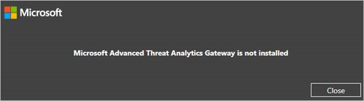

# Nouveautés d’ATA version 1.5
Ces notes de publication fournissent des informations sur les problèmes connus de cette version d’Advanced Threat Analytics.

## Quelles sont les nouveautés d’ATA 1.5 ?
ATA 1.5 comporte les améliorations suivantes :

-   Détection plus rapide

-   Algorithme de détection automatique amélioré pour les périphériques de traduction d’adresses réseau (NAT)

-   Processus de résolution des noms amélioré pour les appareils non joints à un domaine

-   Prise en charge de la migration des données pendant les mises à jour

-   Meilleure réactivité de l’interface utilisateur face à des activités suspectes impliquant plusieurs milliers d’entités

-   Résolution automatique améliorée pour les alertes de surveillance

-   Compteurs de performances supplémentaires pour une meilleure surveillance et une meilleure résolution des problèmes

## Problèmes connus
Les problèmes connus de cette version sont les suivants :

### Échec des nouvelles installations de la passerelle ATA
Après la mise à jour vers ATA version 1.5, vous obtenez l’erreur suivante lors de l’installation d’une nouvelle passerelle ATA : « La passerelle Microsoft Advanced Threat Analytics n’est pas installée ».

<b>Solution de contournement :</b> envoyez un e-mail à l’adresse <ataeval@microsoft.com> pour obtenir la procédure de contournement.
### Déploiement
Le dossier spécifié pour « Chemin d’accès des données de la base de données » et « Chemin d’accès du journal de base de données » doit être vide (aucun fichier ou ni sous-dossier).
S’il n’est pas vide, le déploiement ne peut pas progresser.

### Installation à partir du fichier .zip
Quand vous installez la passerelle ATA, assurez-vous d’extraire les fichiers du fichier .zip dans un répertoire local et de les installer dans ce répertoire. N’installez pas la passerelle ATA directement à partir du fichier .zip, car l’installation échoue.

### Configuration
Une fois la passerelle ATA configurée, au premier démarrage de celle-ci, l’étiquette « Non synchronisé » s’affiche jusqu’à ce que le service soit complètement démarré, ce qui peut prendre jusqu’à 10 minutes la première fois.

### Logiciel de capture du réseau
Dans la passerelle ATA, le seul logiciel de capture réseau que vous pouvez installer est [Moniteur réseau Microsoft 3.4](http://www.microsoft.com/download/details.aspx?id=4865). N’installez pas l’analyseur de message Microsoft ni aucun autre logiciel de capture réseau. L’installation d’autres logiciels empêchera la passerelle ATA de fonctionner correctement.

### Base de connaissance sur les hôtes de virtualisation
N’installez pas la base de connaissance 3047154 sur un hôte de virtualisation, car cela empêcherait le bon fonctionnement de la mise en miroir des ports.

## Voir aussi

[Mise à jour d’ATA vers la version 1.5 : guide de migration](ata-update-1.5-migration-guide.md)

[Mise à jour d’ATA vers la version 1.6 : guide de migration](ata-update-1.6-migration-guide.md)

[Consultez le forum ATA !](https://social.technet.microsoft.com/Forums/security/home?forum=mata)
