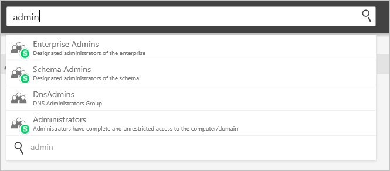
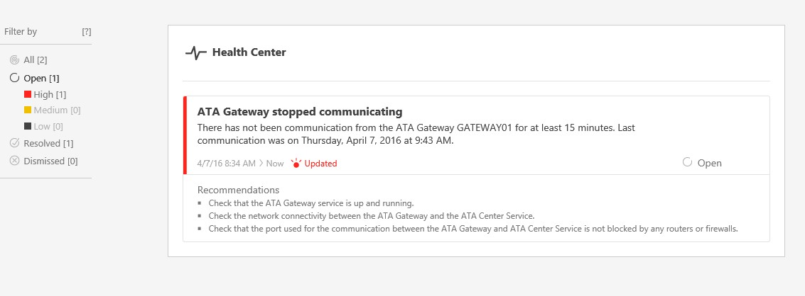

*S’applique à : Advanced Threat Analytics version 1.8*

# Utilisation de la console ATA

Utilisez la console ATA pour surveiller les activités suspectes et les gérer.

Tapez « ? » pour obtenir les raccourcis clavier d’accessibilité du portail ATA. 

## Activation de l’accès à la console ATA

Pour ouvrir une session dans la console ATA, vous devez utiliser le compte d’un utilisateur auquel a été attribué le rôle ATA approprié pour accéder à la console ATA. Pour plus d’informations sur le contrôle d’accès en fonction du rôle (RBAC) dans ATA, consultez [Utilisation de groupes de rôles ATA](ata-role-groups.md).

## Connexion à la console ATA

1. Sur le serveur du centre ATA, cliquez sur l’icône **Console ATA Microsoft** sur le Bureau ou ouvrez un navigateur pour accéder à la console ATA.

    

>[!NOTE]
> Vous pouvez également ouvrir un navigateur à partir du centre ATA ou de la passerelle ATA et accéder à l’adresse IP que vous avez configurée dans l’installation du centre ATA pour la console ATA.    

2.  Si l’ordinateur où le centre ATA est installé et l’ordinateur à partir duquel vous tentez d’accéder à la console ATA sont joints à un domaine, ATA prend en charge l’authentification unique intégrée avec l’authentification Windows. Si vous avez déjà ouvert une session sur votre ordinateur, ATA utilise ce jeton pour vous connecter à la console ATA. Vous pouvez également vous connecter à l’aide d’une carte à puce. Vos autorisations dans ATA correspondent à votre [rôle administrateur](ata-role-groups.md).

> [!NOTE]
> Veillez à ouvrir une session sur l’ordinateur à partir duquel vous voulez accéder à la console ATA en utilisant votre nom d’utilisateur et votre mot de passe d’administrateur ATA. Vous pouvez également exécuter votre navigateur en tant qu’un autre utilisateur, ou vous déconnecter de Windows et ouvrir une session avec votre utilisateur administrateur ATA. Pour faire en sorte que la console ATA demande des informations d’identification, accédez à la console en utilisant une adresse IP : vous êtes alors invité à entrer des informations d’identification.

Pour vous connecter à l’aide de l’authentification unique, vérifiez que le site de la console ATA est défini en tant que site intranet local dans votre navigateur et que vous y accédez en utilisant un nom court ou un localhost.

> [!NOTE]
> En plus de la journalisation de chaque alerte d’activité suspecte et d’intégrité, chaque modification de configuration apportée à la console ATA est auditée dans le journal des événements Windows sur l’ordinateur du centre ATA, sous **Journal des applications et des services** puis **Microsoft ATA**. Chaque connexion à la console ATA est également auditée.    Les configurations qui affectent la passerelle ATA sont également consignées dans le journal des événements Windows de l’ordinateur de la passerelle ATA. 

## Console ATA

La console ATA fournit un aperçu rapide de toutes les activités suspectes par ordre chronologique. Elle vous permet d’examiner les détails de toutes les activités et d’effectuer des actions en fonction de ces activités. La console affiche également des alertes et des notifications pour signaler des problèmes liés au réseau ATA ou aux nouvelles activités considérées comme suspectes.

Voici les principaux éléments de la console ATA.

### Chronologie des attaques

Il s’agit de la page de destination qui s’affiche par défaut quand vous vous connectez à la console ATA. Par défaut, toutes les activités suspectes ouvertes sont affichées dans la chronologie des attaques. Vous pouvez filtrer la chronologie des attaques de manière à tout afficher ou de manière à afficher uniquement les activités suspectes dont l’état est Ouvert, Résolu ou Ignoré. Vous pouvez également voir le niveau de gravité attribué à chaque activité.

Pour plus d’informations, consultez [Gestion des activités suspectes](working-with-suspicious-activities.md).

### Barre de notification

Quand une activité suspecte est détectée, la barre de notification s’ouvre automatiquement sur la droite. Si de nouvelles activités suspectes ont été détectées depuis la dernière ouverture de session, la barre de notification s’ouvrira après votre connexion. Pour accéder à la barre de notification, vous pouvez cliquer sur la flèche de droite à tout moment.

### Filtrage du panneau

Vous pouvez filtrer les activités suspectes qui s’affichent dans la chronologie des attaques ou sous l’onglet Activités suspectes du profil d’entité, selon leur l’état et leur niveau de gravité.

### Barre de recherche

Le menu supérieur comprend une barre de recherche. Vous pouvez rechercher un utilisateur spécifique, un ordinateur ou un groupe dans ATA. Pour tester la fonction de recherche, commencez à taper un nom.

### Centre d’intégrité

Le centre d’intégrité envoie des alertes quand un élément du déploiement ATA ne fonctionne pas correctement.

Quand votre système rencontre un problème, par exemple une erreur de connectivité ou une passerelle ATA déconnectée, l’icône du centre d’intégrité vous en informe à l’aide d’un point rouge. 

Les alertes du centre d’intégrité peuvent être ignorées ou résolues, et classées comme étant d’importance haute, moyenne ou faible. Si vous résolvez une alerte que le service ATA détecte comme étant toujours active, elle sera automatiquement mise dans la liste des alertes ouvertes. Si le système détecte que l’alerte n’a plus de raison d’être (le problème a été résolu), l’alerte est placée automatiquement dans la liste des alertes résolues.

### Profils d’utilisateur et d’ordinateur

ATA crée un profil pour chaque utilisateur et chaque ordinateur du réseau. Le profil utilisateur contient des informations générales, telles que l’appartenance aux groupes, les connexions récentes et les ressources récemment consultées. Il fournit également une liste des emplacements où l’utilisateur s’est connecté via un VPN. Pour obtenir la liste des appartenances aux groupes considérées comme sensibles, voir ci-dessous.

Le profil d’ordinateur contient des informations générales, comme les connexions récentes et les ressources qui ont récemment fait l’objet d’un accès.

ATA fournit des informations supplémentaires sur les entités (ordinateurs, appareils, utilisateurs) dans les pages suivantes : Résumé, Activités et Activités suspectes.

Quand ATA n’est pas en mesure de résoudre complètement un profil, il l’indique par une icône représentant un cercle à demi rempli.

### Groupes sensibles

Les groupes de la liste suivante sont considérés comme **sensibles** par ATA. Il s’agit de groupes qui seront marqués comme ayant des privilèges d’administrateur et qui déclenchent des alertes correspondant à des comptes sensibles :

- Contrôleurs de domaine d’entreprise en lecture seule 
- Administrateurs du domaine 
- Contrôleurs de domaine 
- Administrateurs de schéma
- Administrateurs de l’entreprise 
- Propriétaires créateurs de la stratégie de groupe 
- Contrôleurs de domaine en lecture seule 
- Administrateurs  
- Utilisateurs avec pouvoir  
- Opérateurs de compte  
- Opérateurs de serveur   
- Opérateurs d’impression
- Opérateurs de sauvegarde
- Duplicateurs 
- Utilisateurs du Bureau à distance 
- Opérateurs de configuration réseau 
- Générateurs d’approbation de forêt entrante 
- Administrateurs DNS 

### Mini-profil

Quand une entité est présentée dans la console (par exemple un utilisateur ou un ordinateur), si vous pointez votre souris dessus, un mini-profil s’ouvre automatiquement et affiche les informations suivantes si elles sont disponibles :

-   Nom

-   Image

-   E-mail

-   Téléphone

-   Nombre d’activités suspectes par niveau de gravité

## Voir aussi

[Consultez le forum ATA !](https://social.technet.microsoft.com/Forums/security/home?forum=mata)
