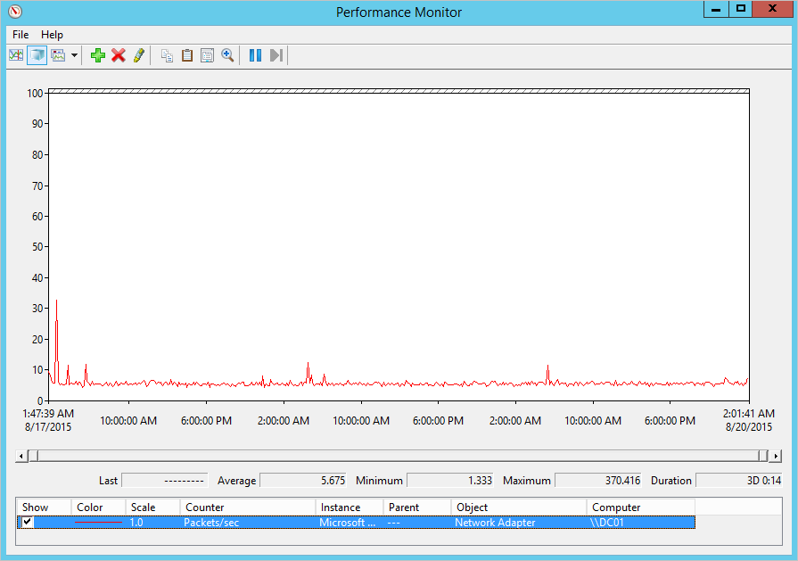

*S’applique à : Azure - Protection avancée contre les menaces*

# Planification de la capacité Azure ATP
Cet article vous aide à déterminer le nombre de capteurs autonomes et de capteurs Azure ATP dont vous avez besoin.

> [!NOTE] 
> L’outil de dimensionnement présente deux feuilles : une pour ATA et une pour Azure ATP. Vérifiez que vous êtes sur la feuille appropriée.

## Utilisation de l’outil de dimensionnement
La manière recommandée la plus simple de déterminer la capacité pour votre déploiement Azure ATP est d’utiliser [l’outil de dimensionnement Azure ATP](http://aka.ms/aatpsizingtool). Exécutez l’outil de dimensionnement Azure ATP et, dans les résultats du fichier Excel, utilisez les champs suivants pour déterminer la mémoire et le processeur utilisés par le capteur :

- Capteur Azure ATP : faites correspondre le champ **Paquets occupés/s** du tableau du capteur Azure ATP dans le fichier de résultats au champ **PAQUETS PAR SECONDE** dans le [tableau du capteur autonome Azure ATP](#azure-atp-sensor-sizing) ou [tableau du capteur Azure ATP](#azure-atp-standalone-sensor-sizing), selon le [type de capteur que vous choisissez](#choosing-the-right-sensor-type-for-your-deployment).

Si, pour une raison ou une autre, vous ne pouvez pas utiliser l’outil de dimensionnement Azure ATP, collectez manuellement les informations du compteur de paquets/s de tous vos contrôleurs de domaine pendant 24 heures avec un intervalle de collecte court (environ 5 secondes). Ensuite, pour chaque contrôleur de domaine, vous devez calculer la moyenne quotidienne et la moyenne des périodes les plus occupées (15 minutes).
Les sections suivantes expliquent comment collecter le compteur paquets/s dans un contrôleur de domaine.

## Choix du type de capteur approprié pour votre déploiement
Dans un déploiement Azure ATP, n’importe quelle combinaison de types de capteurs autonomes Azure ATP est prise en charge :

- Uniquement des capteurs autonomes Azure ATP
- Uniquement un capteur Azure ATP
- Une combinaison des deux

Quand vous choisissez le type de déploiement de capteur, prenez en compte les avantages suivants :

|Type de capteur|Avantages|Coût|Topologie de déploiement|Utilisation des contrôleurs de domaine|
|----|----|----|----|-----|
|Capteur autonome Azure ATP|Avec un déploiement hors bande, il est plus difficile pour les attaquants de découvrir la présence d’Azure ATP|Plus élevé|Installée en même temps que le contrôleur de domaine (hors bande)|Prend en charge jusqu’à 100 000 paquets par seconde|
|Capteur Azure ATP|Ne nécessite pas de configuration de la mise en miroir de port ni de serveur dédié|Plus faible|Installée sur un contrôleur de domaine|Prend en charge jusqu’à 100 000 paquets par seconde|

Prenez en compte les problèmes suivants quand vous choisissez le nombre de capteurs autonomes Azure ATP à déployer.

-   **Forêts et domaines Active Directory** 
    Azure ATP peut surveiller le trafic à partir de plusieurs domaines au sein d’une forêt Active Directory unique pour chaque espace de travail que vous créez. Pour surveiller plusieurs forêts, vous devez créer plusieurs espaces de travail. 

-   **Mise en miroir des ports** 
Les considérations relatives à la mise en miroir des ports peuvent vous amener à déployer plusieurs capteurs autonomes Azure ATP par site de succursale ou centre de données.

-   **Capacité** 
    Un capteur autonome Azure ATP peut prendre en charge la surveillance de plusieurs contrôleurs de domaine, en fonction du volume du trafic réseau lié aux contrôleurs de domaine surveillés. 

## Dimensionnement du capteur autonome et du capteur Azure ATP 

Un capteur Azure ATP peut prendre en charge la surveillance d’un contrôleur de domaine en fonction de la quantité de trafic réseau qu’il génère. Le tableau suivant est une estimation, la quantité finale analysée par le capteur étant dépendante du volume du trafic. 

|Paquets par seconde*|Cœurs de processeur|Mémoire (Go)|
|----|----|-----|
|0 à 1 000|0,25|2,50|
|1 000 à 5 000|0,75|6,00|
|5 000 à 10 000|1,00|6,50|
|10 000 à 20 000|2,00|9,00|
|20 000 à 50 000|3,50|9,50|
|50 000 à 75 000 |3,50|9,50|
|75 000 à 100 000|3,50 |9,50|

> [!NOTE]
> - Nombre total de cœurs installés sur ce contrôleur de domaine. Nous vous recommandons de ne pas utiliser des cœurs hyper-thread.
> - Quantité totale de mémoire installée sur ce contrôleur de domaine.
> -   Si le contrôleur de domaine n’a pas les ressources demandées par le capteur Azure ATP, les performances du contrôleur de domaine ne sont pas affectées, mais le capteur Azure ATP risque de ne pas fonctionner comme prévu.
> -   En cas d’exécution en tant que machine virtuelle, la mémoire dynamique ou toute autre fonctionnalité d’augmentation de la mémoire n’est pas prise en charge.
> -   Pour bénéficier de performances optimales, choisissez **Hautes performances** comme **Option d’alimentation** pour le capteur Azure ATP.
> -   Au moins 2 cœurs et 6 Go d’espace sont nécessaires, et 10 Go sont recommandés, dont l’espace requis pour les fichiers binaires Azure ATP.

## Estimation du trafic des contrôleurs de domaine

Il existe différents outils qui permettent de détecter le nombre moyen de paquets par seconde de vos contrôleurs de domaine. Si vous n’avez pas d’outil permettant d’effectuer le suivi de ce compteur, vous pouvez utiliser l’Analyseur de performances pour collecter les informations nécessaires.

Pour déterminer le nombre de paquets par seconde, effectuez les étapes suivantes pour chaque contrôleur de domaine :

1.  Ouvrez l’Analyseur de performances.

    

2.  Développez **Ensembles de collecteurs de données**.

    

3.  Cliquez avec le bouton droit sur **Défini par l’utilisateur**, puis sélectionnez **Nouveau** &gt; **Ensemble de collecteurs de données**.

    

4.  Entrez un nom pour l’ensemble de collecteurs, puis sélectionnez **Créer manuellement (avancé)**.

5.  Sous **Quel type de données inclure ?**, sélectionnez **Créer des journaux de données et Compteur de performances**.

    

6.  Sous **Quels compteurs de performance enregistrer dans un journal ?**, cliquez sur **Ajouter**.

7.  Développez **Carte réseau**. Sélectionnez **Paquets/s**, puis l’instance appropriée. Si vous n’êtes pas sûr, vous pouvez sélectionner **&lt;Toutes les instances&gt;**, puis cliquer sur **Ajouter** et **OK**.

    > [!NOTE]
    > Pour effectuer cette opération dans une ligne de commande, exécutez `ipconfig /all` pour afficher le nom de la carte réseau et sa configuration.

    

8.  Remplacez la valeur **Intervalle d’échantillonnage** par **cinq secondes**.

9. Définissez l’emplacement où vous voulez enregistrer les données.

10. Sous **Créer l’ensemble de collecteurs de données**, sélectionnez **Démarrer maintenant cet ensemble de collecteurs de données**, puis cliquez sur **Terminer**.

    Vous devez maintenant voir l’ensemble de collecteurs de données que vous venez de créer avec un triangle vert indiquant qu’il est activé.

11. Au bout de 24 heures, arrêtez l’ensemble de collecteurs de données en cliquant dessus avec le bouton droit et en sélectionnant **Arrêter**.

    

12. Dans l’Explorateur de fichiers, accédez au dossier où le fichier .blg a été enregistré, puis double-cliquez dessus pour l’ouvrir dans l’Analyseur de performances.

13. Sélectionnez le compteur Paquets par seconde, puis enregistrez les valeurs moyenne et maximale.

    

## Voir aussi
- [Outil de dimensionnement Azure ATP](http://aka.ms/aatpsizingtool)
- [Prérequis d’Azure ATP](atp-prerequisites.md)
- [Architecture Azure ATP](atp-architecture.md)
- [Consultez le forum ATP !](https://aka.ms/azureatpcommunity)
