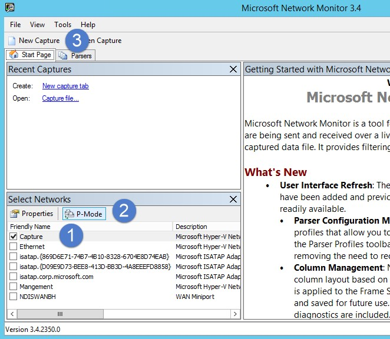

*S’applique à : Azure - Protection avancée contre les menaces*

# Valider la mise en miroir des ports
> [!NOTE] 
> Cet article s’applique uniquement si vous déployez le capteur autonome Azure ATP à la place du capteur Azure ATP. Pour déterminer si vous devez utiliser le capteur Azure ATP, consultez [Choix des capteurs appropriés pour votre déploiement](atp-capacity-planning#choosing-the-right-sensor-type-for-your-deployment).
 
Les étapes suivantes sont conçues pour vous guider dans le processus de validation de la mise en miroir des ports. Pour qu’Azure ATP fonctionne correctement, le capteur autonome Azure ATP doit pouvoir voir le trafic entrant et sortant du contrôleur de domaine. La principale source de données utilisée par Azure ATP est l’inspection approfondie des paquets du trafic réseau entrant et sortant de vos contrôleurs de domaine. Pour qu’Azure ATP puisse voir le trafic réseau, vous devez configurer la mise en miroir des ports. La mise en miroir des ports copie le trafic d’un port (le port source) vers un autre port (le port de destination).

## Valider la mise en miroir à l’aide du Moniteur réseau
1.  Installez [Moniteur réseau Microsoft 3.4](http://www.microsoft.com/download/details.aspx?id=4865) sur le capteur autonome ATP que vous souhaitez valider.

    > [!IMPORTANT]
    > Si vous choisissez d’installer Wireshark afin de valider la mise en miroir des ports, redémarrez le service du capteur autonome Azure ATP après la validation.

2.  Ouvrez le Moniteur réseau et créez un nouvel onglet de capture.

    1.  Sélectionnez uniquement la carte réseau **Capture** ou celle qui est connectée au port de commutateur qui est configuré comme le port de destination de la mise en miroir.

    2.  Assurez-vous que le mode P est activé.

    3.  Cliquez sur **Nouvelle capture**.

        

3.  Dans la fenêtre Filtre d’affichage, entrez le filtre **KerberosV5 OR LDAP**, puis cliquez sur **Appliquer**.

    

4.  Pour démarrer la session de capture, cliquez sur **Démarrer**. Si vous ne voyez pas le trafic entrant et sortant du contrôleur de domaine, examinez la configuration de mise en miroir des ports.

    

    > [!NOTE]
    > Il est important de vous assurer que vous voyez le trafic entrant et sortant des contrôleurs de domaine.
    

5.  Si vous voyez uniquement le trafic dans un sens, vous devez résoudre ce problème de configuration de la mise en miroir des ports avec l’aide de l’équipe chargée du réseau ou de la virtualisation.

## Voir aussi

- [Configurer le transfert d’événements](configure-event-forwarding.md)
- [Configurer la mise en miroir des ports](configure-port-mirroring.md)
- [Consulter le forum ATP](https://aka.ms/azureatpcommunity)
